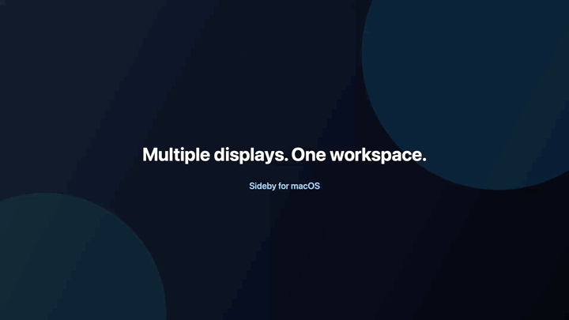

# Sideby

[English](README.md) | 한국어

Sideby는 여러 디스플레이를 하나의 작업 Context처럼 함께 움직이게 해주는 네이티브 macOS 메뉴 막대 앱입니다.

함께 사용할 디스플레이를 선택하고 현재 Space 구성을 캡처한 뒤, 제스처·단축키·버튼 또는 Context 선택으로 전체 작업공간을 전환할 수 있습니다. Mission Control을 대체하거나 전체 윈도우 매니저가 되기보다 이 한 가지 흐름에 집중합니다.

## 미리 보기

<p align="center">
  
</p>

## Why Sideby

하나의 작업은 여러 디스플레이에 걸쳐 있는 경우가 많습니다. 한 화면에는 코드, 다른 화면에는 참고 자료, 또 다른 화면에는 커뮤니케이션 도구를 둘 수 있습니다. 다음 작업으로 넘어갈 때 각 디스플레이를 따로 전환하는 대신 이 작업공간이 하나의 묶음처럼 움직이는 편이 자연스럽습니다.

Sideby는 디스플레이별 Space 구성을 이름 있는 Context로 만듭니다. 범위는 의도적으로 작게 유지하고, macOS 권한이나 Space 상태 때문에 안전하게 이동할 수 없을 때는 그 한계를 명확하게 알려줍니다.

## 사용 방법

1. **디스플레이 선택:** 함께 움직일 디스플레이를 고릅니다.
2. **Context 캡처:** 현재 Space 배치에서 이름 있는 Context를 만들고, 필요하면 matrix에서 membership을 조정합니다.
3. **함께 전환:** 제스처, 단축키, 이전/다음 버튼 또는 Context 선택으로 전체 작업공간을 이동합니다.

## 기능

### Contexts

- 현재 멀티 디스플레이 Space 배치를 즉시 캡처하고, layout query를 사용할 수 없으면 walk-based fallback을 사용합니다.
- 고정된 Context 개수 제한 없이 발견한 모든 Space를 캡처합니다.
- 빈 Context를 추가하고 Context matrix에서 디스플레이 Space membership을 구성합니다.
- 실제 macOS Space를 지우지 않고 Context만 삭제합니다. 빈 Context는 즉시 삭제하고, Space가 매핑된 Context는 확인 후 삭제합니다.
- 선택한 디스플레이의 live Space 개수 중 최솟값 아래로 Context를 삭제할 수 없으며, live layout을 신뢰할 수 없으면 삭제하지 않습니다.
- 디스플레이별 현재 Space 위치가 달라도 중간 빈칸을 보존해 membership이 Context 1부터 연속일 필요가 없습니다.

### Switching

- 디스플레이별 목표 Space index를 사용해 선택한 디스플레이를 이전 또는 다음 Context로 이동합니다.
- Context matrix에서 이름 있는 Context를 직접 활성화합니다.
- 선택한 디스플레이를 기준 디스플레이가 나타내는 Context에 맞춥니다.
- 외부 Space 변경으로 Context matching이 안전하지 않으면 일반 이동으로 돌아갑니다.
- 이동이 끝나면 화면 중앙의 간결한 Context HUD로 결과를 확인합니다.
- `Option + Shift`를 누른 채 `1...9` 또는 `0`으로 Context 1~10에 바로 이동하고, `⌥⇧< / ⌥⇧>`로 한 Context씩 이동합니다.

### Customization

- 일반 Previous/Next Space 이동에 사용할 Move Targets를 선택합니다.
- 디스플레이 Space 위치를 드래그해 캡처된 membership을 조정합니다.
- 디스플레이 행 순서를 바꾸고 디스플레이 이름 열 너비를 조절합니다.
- 기본 `Option + Shift + horizontal swipe`, 고정 Context 키보드 레이어 또는 인라인 컨트롤을 사용합니다.
- 캡처된 Space에 이름과 best-effort visible app/window suggestion을 적용합니다.

### Native macOS Experience

- Dock에 계속 남지 않는 메뉴 막대 전용 인터페이스와 리사이즈 가능한 팝오버
- Accessibility와 Screen Switching access를 설명하는 온보딩과 진단
- 영어와 한국어 UI
- Sparkle 2를 통한 서명된 업데이트 확인, 다운로드 및 사용자 승인 설치

## 설치와 빠른 시작

Sideby는 macOS 14 이상을 지원합니다.

[GitHub Releases](https://github.com/ethznn/sideby/releases)에서 최신 서명·공증 DMG를 다운로드하고 Sideby를 Applications로 옮긴 뒤 실행하세요. Sideby는 메뉴 막대에 머물며 Dock 아이콘을 계속 표시하지 않습니다. 컨트롤을 다시 열려면 메뉴 막대의 Sideby 항목을 사용합니다.

처음 실행하면 설정한 제스처를 감지하고 요청한 Space 전환 명령을 보내는 데 필요한 권한을 macOS가 요청합니다.

- 전역 제스처 감지를 위한 **Accessibility**
- Previous/Next Space 명령을 보내기 위한 **Screen Switching access**
- 현재 명령 경로에서 필요한 경우 **System Events Automation**

Sideby는 Space 전환, Context Capture, Align Displays를 위해 Screen Recording 권한을 요청하지 않습니다.

소스에서 빌드하려면 Swift 6 toolchain이 포함된 Xcode를 설치하고 다음 명령을 실행합니다.

```bash
swift test
scripts/build_app_bundle.sh
open "dist/Sideby.app"
```

로컬 앱을 다시 빌드한 뒤에도 macOS가 권한을 거부 상태로 표시하면 시스템 설정에서 기존 Sideby 항목을 제거하고 새 번들을 다시 추가하세요.

## 개인정보와 플랫폼 안내

Sideby는 마스터 토글이 켜져 있는 동안 설정된 제스처를 감지하기 위해 Accessibility를 사용합니다. 또한 허용된 전환 또는 캡처 요청 뒤에 Space 명령을 보내고, Context Capture 중 화면에 보이는 앱/윈도우 이름을 가능한 범위에서 제안하기 위해 Accessibility를 사용합니다. 앱이 실행 중일 때는 마스터 토글이 꺼진 상태를 안내할 수 있도록 macOS 전역 hot-key 등록으로 고정 `Option + Shift + 숫자 / < / >` 조합만 감지합니다. 다른 키 입력을 검사하거나 저장하지 않습니다.

macOS가 제공할 때 현재 디스플레이별 Space layout을 런타임에 읽지만 private Space ID, 숨겨진 Mission Control 상태, 입력 내용, raw input event, 스크린샷, app bundle ID 또는 window ID를 저장하지 않습니다.

다음 사용자 설정만 Mac에 로컬로 저장합니다.

- Context 이름과 정의
- 디스플레이 membership과 캡처된 디스플레이별 Space index
- 디스플레이 행 순서
- 단축키와 입력 설정
- 사용자가 작성한 라벨

Context 삭제는 Sideby에 저장된 매핑만 제거하며 실제 macOS Space는 삭제하지 않습니다.

현재 직접 배포 빌드는 App Sandbox가 꺼져 있습니다. Context Capture와 Align Displays는 가능할 때 read-only SkyLight layout query를 사용하고, Capture에는 공개 명령 기반 fallback을 제공합니다. 따라서 Sideby는 Mac App Store 배포를 목표로 하지 않습니다.

## 개발

Xcode에서 Swift package를 직접 엽니다.

```bash
xed Package.swift
```

제품 앱은 `SidebyApp`, 로컬 probe와 macOS API 실험은 `SidebyDevApp`을 사용합니다.

```bash
swift test
swift build --product SidebyApp
swift build --product SidebyDevApp
scripts/build_app_bundle.sh
scripts/build_dev_app_bundle.sh
```

`SidebyDevApp`은 로컬 테스트 하네스이며 릴리스 번들이 아닙니다. 제품 번들은 `Resources/AppIcon.icns`를 사용합니다.

## 아키텍처

Sideby는 작은 SwiftPM 모듈로 나뉩니다.

```text
Sources/
  SidebyApp/        제품 앱, 메뉴 막대, 패널, 온보딩
  SidebyDevApp/     로컬 probe와 진단
  SidebyDevSupport/ SidebyDevApp에서 사용하는 probe helper
  SidebyCore/       도메인 모델, 제스처 로직, 설정, 진단
  SidebySystem/     macOS API adapter
  SidebyUI/         재사용 SwiftUI view와 view model
Tests/
  SidebyCoreTests/
  SidebySystemTests/
  SidebyUITests/
```

중요한 경계는 다음과 같습니다.

- Space 전환은 `ContextSwitchEngine`과 `SpaceCommandExecutor`를 통합니다.
- 전역 입력과 macOS adapter는 `SidebySystem`에 둡니다.
- 제스처 해석과 Context 규칙은 `SidebyCore`의 순수 Swift 로직에 둡니다.
- 재사용 UI는 SwiftUI가 맡고 메뉴 막대, 창, 시스템 연동은 AppKit adapter가 처리합니다.

개발 및 릴리스 설정은 [Development](docs/DEVELOPMENT.md), 사용자를 보호하는 기술 경계는 [Decisions](docs/DECISIONS.md)를 참고하세요.

## 기여

기여를 환영합니다. 이슈나 pull request를 열기 전에 [CONTRIBUTING.md](CONTRIBUTING.md)를 읽고, 코드 변경에는 `swift test`를 실행해 주세요.

권한, 입력, 전환, 패키징 또는 배포에 관련된 변경은 트레이드오프가 명확해지도록 먼저 이슈를 열어 주세요.

## 보안

보안 취약점은 공개 이슈로 제보하지 말아 주세요. [SECURITY.md](SECURITY.md)의 제보 절차를 이용해 주세요.

## 라이선스

Sideby는 [MIT License](LICENSE)로 배포됩니다.
