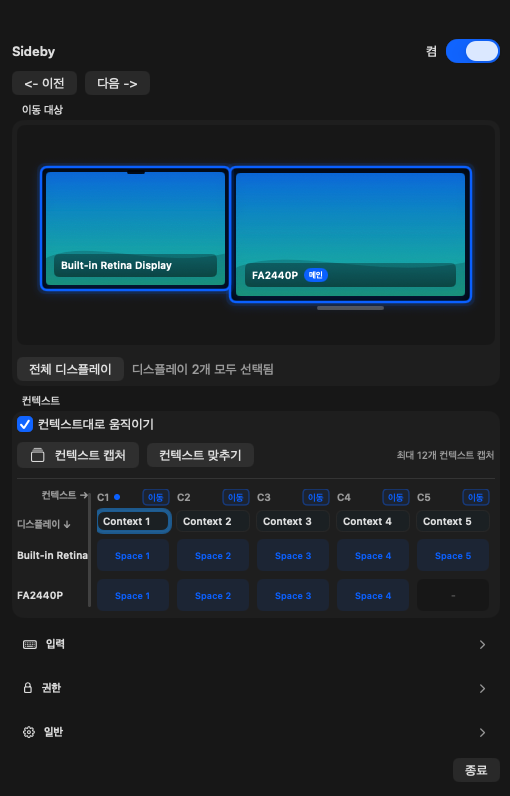

# Sideby

[English](README.md) | 한국어

Sideby는 여러 디스플레이를 사용하는 macOS 사용자가 여러 화면을 하나의 작업 컨텍스트처럼 함께 전환할 수 있게 돕는 네이티브 메뉴바 유틸리티입니다. 제품 슬로건은 "Side by Side"입니다.

Sideby는 Mission Control 대체제나 전체 윈도우 매니저가 아닙니다. 함께 이동할 디스플레이를 고르고, Sideby를 켠 뒤, 제스처나 선택적 단축키로 이전/다음 macOS Space로 이동하는 좁은 워크플로에 집중합니다.

## 미리 보기

<p align="center">
  
</p>

## 만들게 된 배경

Sideby는 한 작업 컨텍스트를 여러 디스플레이에 나눠 정리해두고 싶은 생각에서 출발했습니다. 각 화면에는 같은 일의 서로 다른 조각이 놓여 있고, 컨텍스트를 바꿀 때는 그 화면 묶음이 디스플레이별로 따로 움직이는 대신 함께 이동하면 좋겠다고 봤습니다.

Sideby의 목표는 멀티 디스플레이 환경을 하나의 작업공간처럼 묶고, 그 작업공간을 한 번의 의도적인 행동으로 옮기는 것입니다. 범위는 작게 유지하고, 권한이나 Space 한계가 있을 때는 가능한 척하지 않고 명확한 진단으로 설명합니다.

## 현재 상태

Sideby는 pre-1.0 소프트웨어입니다. 0.7.0은 Sparkle 2를 통한 서명된 앱 내 업데이트를 추가하고, 메뉴를 자주 쓰는 컨트롤 중심으로 간결하게 정리했습니다. 최상단에는 Sideby 토글과 이전/다음 버튼을 두고, 이어서 이동 대상과 Context matrix를 보여줍니다. 업데이트 확인은 일반에, 권한 안내는 권한에 있습니다.

현재 릴리즈 전략은 App Sandbox off 직접 배포입니다. Context Capture와 Align Displays는 가능할 때 read-only SkyLight layout query를 사용하고, layout query를 사용할 수 없으면 Capture Contexts는 더 느린 공개 명령 기반 fallback을 사용합니다. 따라서 Sideby는 Mac App Store 배포를 목표로 하지 않습니다.

## 기능

- 고정된 Sideby 토글과 인라인 이전/다음 버튼을 갖춘 리사이즈 가능한 메뉴바 전용 설정 팝오버. Sideby는 Dock에 남지 않습니다.
- 하나 이상의 디스플레이를 묶는 이름 있는 Context
- 각 Context에 속한 디스플레이, Context/디스플레이 방향 축, 내용에 맞춰지는 헤더, 캡처된 Space 번호, 사용자가 정한 디스플레이 행 순서, 드래그 가능한 Space membership, 조절 가능한 디스플레이 이름 열을 확인하는 컴팩트 Context matrix
- 현재 디스플레이/Space 배치에서 Context 묶음을 즉시 만드는 Capture Contexts 흐름. layout query를 사용할 수 없으면 walk-based fallback을 사용합니다.
- 디스플레이별 현재 Space 위치가 다를 때 중간 Context의 빈칸을 보존하는 Context Capture
- 다른 선택 디스플레이를 캡처할 수 있으면 미러링 디스플레이나 독립 Space layout이 없는 디스플레이를 건너뛰는 Context Capture
- 일반 이동 모드에서 함께 전환할 디스플레이를 고르는 Move Targets
- 디스플레이별 목표 Space index를 사용해 이전/다음 Context로 전환하는 Move by Contexts
- Context matrix에서 이름 있는 Context로 바로 이동하는 기능. Sideby가 꺼져 있거나 전환 또는 캡처 중이면 이동할 수 없습니다.
- Context matrix에서 디스플레이 Space 위치를 드래그해 캡처된 membership을 조정하고, 디스플레이 행을 드래그해 matrix 순서를 바꾸는 기능
- 기준 디스플레이의 현재 Space가 나타내는 Context에 선택 디스플레이를 맞추는 Align Displays. 이미 정렬됐거나 해당 Context에 속하지 않은 디스플레이에는 화면 피드백을 표시합니다.
- 공개 macOS 키보드 명령 경로를 통한 Previous/Next Screen Switching
- 기본 입력 습관: `Option + Shift + horizontal swipe`
- 메뉴바 설정 팝오버에서 켤 수 있는 선택적 Previous/Next 키보드 단축키
- 외부 Space 변경으로 Context matching이 안전하지 않을 때 일반 이동으로 돌아가는 best-effort fallback
- Move by Contexts로 전환할 때 화면 중앙에 표시되는 Context HUD
- Accessibility와 Screen Switching access를 안내하는 첫 실행 온보딩
- Display Spaces 라벨과 best-effort visible app/window suggestion
- Sparkle 2를 통한 서명된 앱 내 업데이트 확인, 다운로드 및 사용자 승인 설치
- 영어/한국어 UI 문구

## 요구사항

- macOS 14 이상
- Swift 6 toolchain이 포함된 Xcode
- 전역 입력 감지를 위한 Accessibility 권한
- 요청한 Space 전환 명령을 보내기 위한 Screen Switching access
- 현재 V1 명령 경로에서 필요할 경우 System Events Automation 권한

Sideby는 Screen Switching, Context Capture, Align Displays를 위해 Screen Recording 권한을 요청하지 않습니다.

## 빠른 시작

[GitHub Releases](https://github.com/ethznn/sideby/releases)에서 최신 signed/notarized DMG를 다운로드할 수 있습니다.

0.6.0 이하 사용자는 0.7.0을 한 번 직접 설치해야 합니다. 0.7.0부터는 Sideby가 앱에서 서명된 업데이트를 확인하고 다운로드할 수 있으며, 설치는 사용자의 승인이 있어야 진행됩니다.

저장소를 클론한 뒤 테스트를 실행하고 로컬 제품 번들을 빌드합니다.

```bash
swift test
scripts/build_app_bundle.sh
open "dist/Sideby.app"
```

Sideby는 Dock 아이콘을 표시하지 않고 메뉴바에만 머뭅니다. 컨트롤을 다시 열려면 메뉴바의 Sideby 항목을 사용하세요.

앱을 연 뒤 macOS 시스템 설정에서 요청된 Accessibility와 Screen Switching 권한을 허용합니다. 번들을 다시 빌드한 뒤에도 macOS가 권한을 거부 상태로 표시하면 macOS 시스템 설정에서 기존 Sideby 항목을 삭제하고 다시 빌드한 앱을 추가하세요.

개발과 macOS API 실험에는 dev app을 사용합니다.

```bash
scripts/build_dev_app_bundle.sh
open "dist/SidebyDevApp.app"
```

`SidebyDevApp`은 로컬 테스트 하네스이며 릴리즈 번들이 아닙니다.

## 개발

Xcode에서 Swift package를 직접 엽니다.

```bash
xed Package.swift
```

제품 앱은 `SidebyApp` scheme을, 로컬 dev harness는 `SidebyDevApp` scheme을 사용합니다.

자주 쓰는 명령은 다음과 같습니다.

```bash
swift test
swift build --product SidebyApp
swift build --product SidebyDevApp
scripts/build_app_bundle.sh
scripts/build_dev_app_bundle.sh
```

제품 번들은 `Resources/AppIcon.icns`를 사용합니다. 원본 이미지를 바꾸는 경우 번들 빌드 전에 아이콘을 다시 생성합니다.

```bash
swift scripts/generate_app_icon.swift <source-png> Resources/AppIcon.icns
scripts/build_app_bundle.sh
```

## 아키텍처

저장소는 작은 SwiftPM 모듈로 나뉩니다.

```text
Sources/
  SidebyApp/       product app, menu bar, panels, onboarding
  SidebyDevApp/    local probes and diagnostics
  SidebyDevSupport/ local probe helpers used by SidebyDevApp
  SidebyCore/      domain models, gesture logic, settings, diagnostics
  SidebySystem/    macOS API adapters
  SidebyUI/        reusable SwiftUI views and view models
Tests/
  SidebyCoreTests/
  SidebySystemTests/
  SidebyUITests/
```

중요한 경계는 다음과 같습니다.

- Space 전환은 `ContextSwitchEngine`과 `SpaceCommandExecutor`를 통해서만 호출합니다.
- 전역 입력 어댑터는 `SidebySystem`에 둡니다.
- 제스처 해석은 `SidebyCore`의 순수 Swift 도메인 로직에 둡니다.
- SwiftUI는 재사용 UI를 맡고, 메뉴바/윈도우/시스템 연동은 AppKit 어댑터가 처리합니다.

개발 환경 메모는 [docs/DEVELOPMENT.md](docs/DEVELOPMENT.md)를, 사용자를 보호하기 위한 최소 기술 경계는 [docs/DECISIONS.md](docs/DECISIONS.md)를 참고하세요.

## 개인정보와 권한

Sideby는 Sideby가 켜져 있을 때 설정된 제스처를 감지하기 위해 Accessibility 권한을 사용합니다. 사용자가 행동한 뒤 요청된 Previous/Next Space 명령을 보내기 위해 Screen Switching access를 사용합니다.

Sideby는 macOS가 제공할 때 현재 디스플레이별 Space layout을 런타임에 읽지만, private Space ID나 숨겨진 Mission Control 상태를 저장하지 않습니다. Sideby는 입력 내용, raw input event, 스크린샷, app bundle ID, window ID를 저장하지 않습니다. Context 정의, 디스플레이 membership, 캡처된 디스플레이별 Space index, 디스플레이 행 순서, 단축키 설정, 사용자가 작성한 라벨은 로컬에 저장됩니다.

## 문서

- [Development](docs/DEVELOPMENT.md)
- [Decisions](docs/DECISIONS.md)

## 기여

기여를 환영합니다. 이슈나 pull request를 열기 전에 [CONTRIBUTING.md](CONTRIBUTING.md)를 읽어 주세요.

코드 변경 전에는 `swift test`를 실행해 주세요. 권한, 입력, 전환, 패키징, 릴리즈에 영향을 주는 변경은 먼저 이슈에서 트레이드오프를 논의해 주세요.

## 보안

보안 취약점은 공개 이슈로 제보하지 말아 주세요. 제보 절차는 [SECURITY.md](SECURITY.md)를 참고하세요.

## 라이선스

Sideby는 [MIT License](LICENSE)로 배포됩니다.
