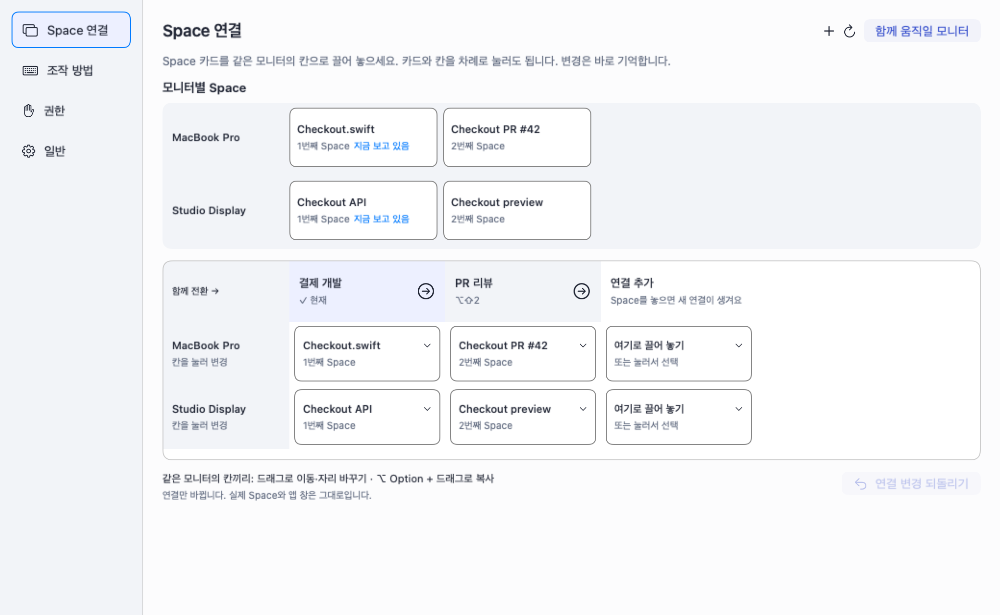

# Sideby

[English](README.md) | 한국어

[공식 사이트](https://ethznn.github.io/sideby/ko/) · [다운로드](https://github.com/ethznn/sideby/releases/latest)

**여러 모니터의 Space를 함께 넘기세요.**

지금 열어 둔 Space의 짝을 맞추면 여러 모니터가 함께 전환됩니다. 환경이 바뀌면 설정에서 열린 내용을 보며 해당 칸만 바꾸세요. 이름을 붙이거나 별도로 저장할 필요가 없습니다.

<p align="center">
  
</p>

*22.5초 모션그래픽 · 가상 데이터로 그린 사용 흐름이며, 실제 앱 캡처나 전환 속도 측정 영상은 아닙니다.*

[정지 이미지](docs/images/sideby-connections-film-ko.png) · [재생·정지 가능한 미리보기](docs/media/preview.html)

*Sideby 1.0.2 사용 안내 · [업데이트 내용](docs/releases/1.0.2.md).*

## 한 화면에서 보고 바로 연결하세요

<p align="center">
  
</p>

*가상 데이터를 넣은 실제 앱 화면입니다.*

1. **메뉴 막대의 Sideby → 설정**을 여세요. ‘Space 연결’이 바로 열립니다.
2. **위쪽에서 각 Space의 내용을 확인하세요.** 읽을 수 있는 앱·창 제목과 Space 순서, ‘지금 보고 있음’ 표시가 나옵니다.
3. **위 카드를 아래 같은 모니터의 빈 칸으로 끌어 놓으세요.** 첫 연결부터 바로 만들 수 있고, 카드를 선택한 뒤 칸을 눌러도 됩니다. 변경은 즉시 기억되며 **되돌리기** 또는 `⌘Z`로 최근 20단계까지 차례로 되돌립니다. 앱을 다시 열어도 복구 기록이 유지됩니다.

같은 열의 Space들이 함께 전환됩니다. 칸을 눌러 직접 선택할 수도 있습니다.

- **새 연결:** 오른쪽 **연결 추가** 열의 빈 칸에 Space를 끌어 놓으세요. + 버튼은 이 빈 열로 이동합니다.
- **이동·자리 바꾸기:** 같은 모니터의 칸끼리 드래그하세요. 빈 칸으로 옮기거나, 채워진 두 칸의 자리를 바꿉니다.
- **복사:** **⌥ Option을 누른 채 놓으면** 원본 칸을 유지합니다. 위쪽 Space 목록에서 가져올 때도 목록은 그대로입니다.
- **실수 복구:** **되돌리기** 한 번으로 두 칸을 함께 복구합니다.

한 칸만 비우려면 칸을 누르고 **이 칸 연결 해제**를 선택하세요. 모니터 이름 옆 **… → 이 모니터의 연결 비우기…**로 해당 행만 정리할 수 있습니다. 연결 해제된 모니터의 정보도 정리할 수 있으며 다른 모니터의 연결은 유지됩니다. 열 제목의 **…** 또는 우클릭 메뉴에서는 열을 지우거나 순서를 바꿉니다.

여러 열을 함께 지우려면 연결표 왼쪽 위의 **여러 연결 선택**을 누르세요. 열 제목이나 칸을 눌러 선택하고 **선택한 N개 삭제…**로 확인합니다. **전체 선택**도 가능하며, **선택 취소**는 연결을 바꾸지 않고 선택 모드를 닫습니다. 선택한 열은 **되돌리기** 한 번으로 함께 복구됩니다. 선택 중에는 칸 편집이나 화면 이동이 일어나지 않습니다.

처음부터 다시 연결하려면 **연결 모두 비우기…**를 누르고 확인하세요. 연결 해제된 모니터의 연결도 함께 비우며, 실제 Space와 열린 앱은 그대로 유지됩니다. 비운 뒤에도 빈 칸이 남아 바로 새 연결을 만들 수 있습니다. 다시 설정하다가 이전 상태로 돌아가려면 **되돌리기**를 차례로 누르세요. 최근 20단계의 연결 변경에 전체 비우기도 포함됩니다.

실제 화면을 이동하려면 열 제목 아래 **함께 이동**을 누르세요. 채워진 카드는 연결된 Space이고, 점선 **+** 칸은 새로 연결할 자리입니다. **연결 추가**를 누르면 빈 열이 나타나며, **…** 메뉴에서 연결 순서를 바꾸거나 삭제할 수 있습니다. 칸 편집과 드래그는 화면을 이동하지 않습니다. 전환에서 제외한 화면은 연결을 바꾸어도 움직이지 않습니다.

## 처음 시작하기

1. [GitHub Releases](https://github.com/ethznn/sideby/releases)에서 DMG를 내려받아 Sideby를 응용 프로그램으로 옮깁니다.
2. 첫 사용 안내에서 손쉬운 사용과 화면 전환 접근을 허용합니다.
3. 빈 칸에서 Space를 골라 연결하세요. **현재 순서로 연결**하면 선택한 모니터의 Space를 같은 순서끼리 한 번에 연결할 수도 있습니다. 별도 이름 입력이나 저장, 전환 연습은 필수가 아닙니다.

이전 버전의 연결·이름·숫자 단축키는 유지됩니다. 다시 만들거나 삭제할 필요가 없습니다. 기존 창에 저장하지 않은 편집이 있다면 먼저 그 편집을 마무리하도록 안내합니다.

## 일상에서는 빠르게

`⌥⇧Space`를 누르면 현재 연결이 보이는 위치에서 전환표가 열립니다. **열의 어느 곳이든 누르면** 연결된 데스크탑으로 함께 이동합니다. 연결을 고칠 때만 **연결 수정**을 누르세요. 편집 패널 위쪽의 **모니터별 Space** 카드를 아래 연결표로 끌어 놓거나, 카드와 같은 모니터의 칸을 차례로 누르세요. 변경은 바로 반영되며 **이동 화면으로** 돌아올 수 있습니다. **설정**에서도 같은 목록과 연결표를 함께 볼 수 있습니다. 메뉴 막대의 연결표에서는 칸을 직접 바꿀 수 있습니다.

| 조작 | 결과 |
| --- | --- |
| `⌥⇧Space` 누르고 있기 | 포인터 가까이에 전환표를 엽니다. 열 전체를 눌러 이동합니다. |
| `⌥⇧Tab` | 직전에 이동한 연결로 돌아갑니다. |
| `⌥⇧1` … `⌥⇧9`, `⌥⇧0` | 해당 숫자가 배정된 연결로 이동합니다. 다른 연결을 지워도 기존 번호는 유지됩니다. |
| `⌥⇧<` / `⌥⇧>` | 이전 / 다음 연결로 이동합니다. |
| Option + Shift + 가로 스와이프 | 기본 제스처로 함께 전환합니다. |

숫자·이전/다음·직전 연결 단축키는 Option과 Shift를 모두 떼면 이동합니다. 누르고 열었던 연결표는 키를 놓으면 닫힙니다. **연결 수정**으로 편집을 시작하면 키를 놓고도 편집할 수 있도록 열려 있습니다. Escape나 닫기 버튼으로 닫으세요. **설정 → 조작 방법**에서 입력 방법을 조정합니다.

## 환경이 바뀌었을 때

데스크탑 순서가 바뀌어도 같은 데스크탑의 연결을 따라갑니다. 없어졌다면 그 칸에 **다시 선택**을 표시하며, 같은 번호의 다른 데스크탑으로 임의 연결하지 않습니다. 추가된 데스크탑은 위 목록에서 찾아 필요한 칸에 연결하세요. 모니터 연결을 빼도 해당 연결은 유지되며 **연결 해제된 모니터 보기**로 확인할 수 있습니다.

앱에서 **Space**는 일반 데스크탑과 전체 화면 앱을 포함하는 macOS 작업 공간이며, **모니터**와 구분합니다. **3번째 Space**는 해당 모니터 목록에서의 순서이며, Mission Control의 실제 이름인 ‘데스크탑 3’을 뜻하지 않습니다. 읽을 수 있는 앱·창 이름을 우선 표시합니다.

연결 편집 화면이 보이는 동안 Space 목록과 읽을 수 있는 앱·창 제목을 자동으로 갱신합니다. Space를 읽지 못했을 때는 모니터 연결을 확인한 뒤 **다시 읽기**를 누르세요. 직접 지정한 데스크탑 이름이 있으면 우선 표시합니다. 이 이름은 macOS Mission Control의 이름을 바꾸지 않습니다. 설정을 기록하지 못하면 기존 연결을 유지하고 실패를 알립니다.

Sideby는 기존 Spaces를 연결하고 전환합니다. 데스크탑을 만들거나 지우고, 앱을 실행하거나 전체 화면으로 만들고, 창 위치를 복원하는 기능은 제공하지 않습니다.

## 개인정보와 플랫폼 안내

설정한 전역 제스처와 가능한 앱·창 제목 제안을 위해 손쉬운 사용 권한을 사용합니다. 화면 전환 접근 권한으로 요청한 데스크탑 이동을 실행하며 일부 경로에는 System Events 자동화 권한도 필요합니다. 전환과 데스크탑 조회를 위해 화면 기록 권한을 요청하지 않습니다.

구성 이름, 데스크탑 연결 정보, 직접 정한 데스크탑 이름, 화면 선택, 단축키 배정, 되돌리기 데이터, 이전 설정 백업, 입력 설정, 안내 진행 상태는 Mac에 로컬로 저장합니다. 실행 중 사용하는 숫자 Space ID·창 ID, 원시 입력 이벤트, 스크린샷은 저장하지 않습니다. 전역 단축키 처리 중 입력한 글자를 기록하지 않습니다.

직접 배포 앱으로, App Sandbox를 끈 상태에서 비공개 SkyLight API를 사용합니다. 업데이트에는 Sparkle 2를 사용하며 설치는 사용자가 승인합니다. 업데이트 창은 앱에서 선택한 언어를 따르며, 언어를 바꾼 경우 Sideby를 다시 열면 적용됩니다. 릴리즈 노트는 영어로 제공합니다.

## 개발

Swift 6 도구 모음으로 Xcode에서 `Package.swift`를 열거나 아래 명령을 실행하세요.

```bash
swift test
swift build --product SidebyApp
swift build --product SidebyDevApp
```

`SidebyApp`은 제품 앱이며 `SidebyDevApp`은 로컬 점검 도구입니다. 로컬 앱 번들을 만들기 전 [Sparkle 피드](https://github.com/ethznn/sideby/releases/latest/download/appcast.xml)의 최신 `sparkle:version`을 확인하고, 여기에 1을 더한 값을 `SIDEBY_BUILD_NUMBER`로 지정해 `scripts/build_app_bundle.sh`를 실행하세요.

[개발 안내](docs/DEVELOPMENT.md), [결정 기록](docs/DECISIONS.md), [README 미디어](docs/media/README.md)를 참고하세요. 문서의 실제 앱 화면은 분리된 샘플 데이터로 만듭니다. GIF와 정지 이미지는 저장소에, 전체 MP4는 로컬에 보관합니다.

## 기여·보안·라이선스

이슈나 PR을 열기 전 [CONTRIBUTING.md](CONTRIBUTING.md)를 읽어 주세요. 보안 문제는 [SECURITY.md](SECURITY.md)의 절차로 제보해 주세요. Sideby는 [MIT License](LICENSE)로 배포합니다.
