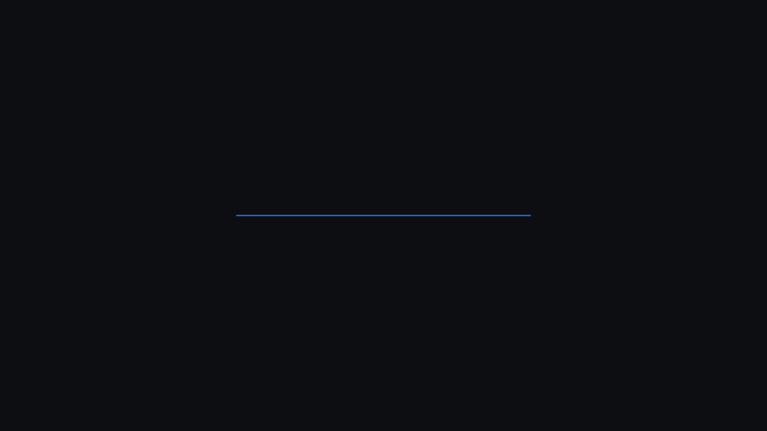
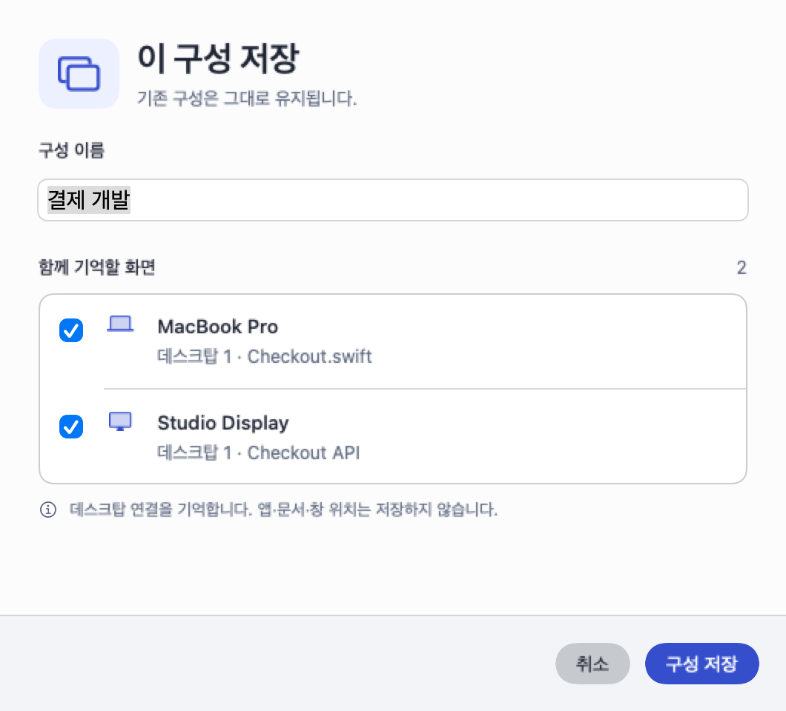
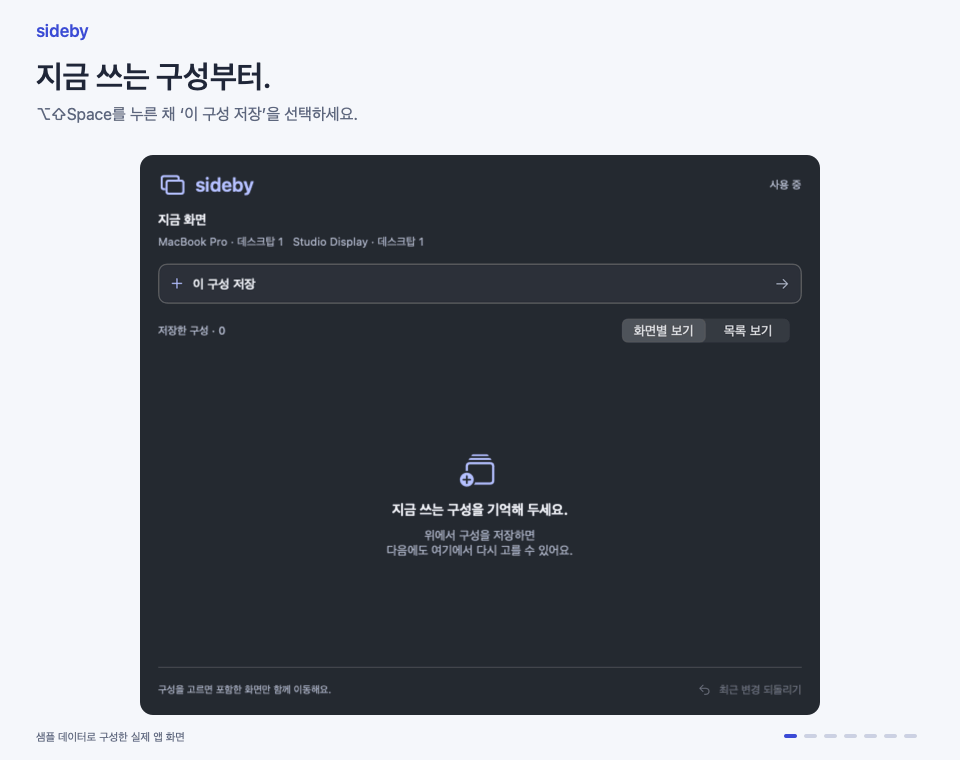
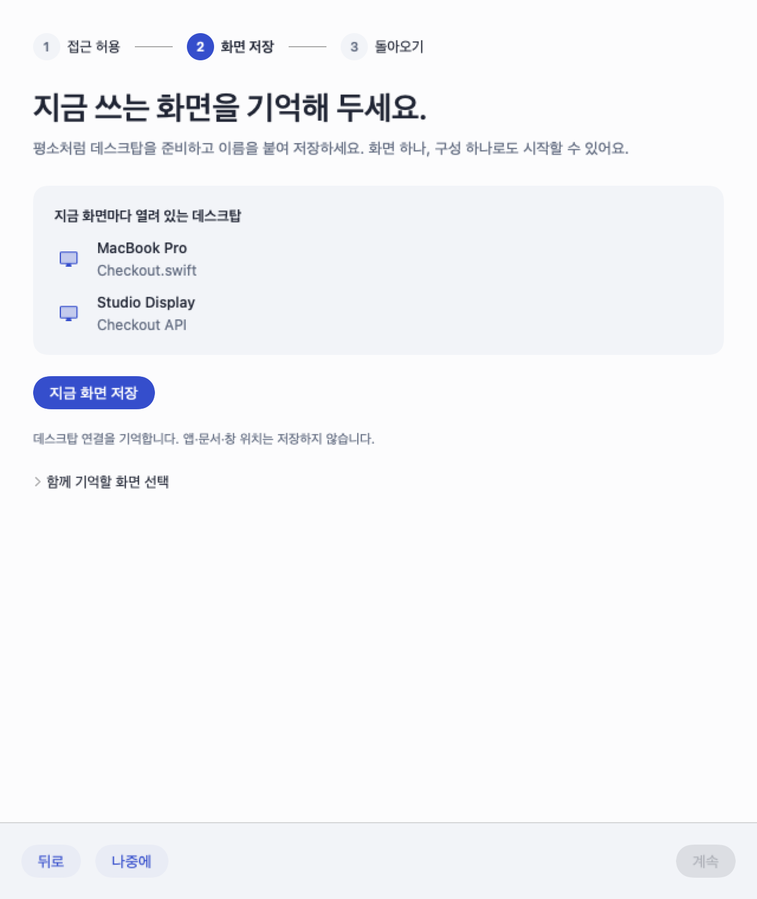

# Sideby

[English](README.md) | 한국어

**하던 일로, 한 번에 돌아오세요.**

<p align="center">
  
</p>

여러 화면에서 지금 쓰는 데스크탑을 하나의 구성으로 저장하세요. 다음에 그 구성을 고르면 필요한 화면들이 함께 전환됩니다. 화면 하나만으로도 사용할 수 있습니다.

*가상 데스크탑과 단순화한 저장 화면으로 만든 홍보 영상입니다. 화면 전환은 사용 흐름을 설명하며 실제 속도를 측정한 것이 아닙니다.* [정지 이미지 보기](docs/images/sideby-kinetic-ko.png).

[Sideby 다운로드](https://github.com/ethznn/sideby/releases) · macOS 14 이상 · 한국어·영어 지원

[Sideby 0.13.0](docs/releases/0.13.0.md)에서는 현재 구성 저장, 구성별 편집, 최근 변경 되돌리기를 지원합니다. 새 화면 디자인은 Mac의 라이트·다크 모드를 따릅니다.

## 일하다가 그대로 저장하세요

1. **평소처럼 데스크탑을 준비하세요.** 각 화면에서 사용할 앱과 문서를 열어 둡니다.
2. **`⌥⇧Space`를 누른 채 ‘이 구성 저장’을 고르세요.** 단축키에서 손을 떼고 이름과 함께 기억할 화면을 확인한 뒤 저장합니다.
3. **다시 필요할 때 그 구성을 고르세요.** 포함한 화면들이 함께 이동합니다. `⌥⇧Tab`을 누르면 직전 구성으로 돌아갑니다.

처음부터 모든 구성을 정리할 필요는 없습니다. 지금 쓰는 구성 하나를 저장하고, 다른 구성이 필요해졌을 때 추가하세요. 새로 설치하면 목록은 비어 있습니다. 저장할 때마다 구성 하나가 추가되고, 기존 구성은 유지됩니다.

<p align="center">
  
</p>

Sideby는 기존 macOS 데스크탑의 연결을 기억합니다. 스크린샷을 저장하거나 앱·문서를 다시 열고 창 위치를 복원하는 기능은 아닙니다.

<details>
<summary>실제 앱 화면으로 저장 흐름 보기</summary>

<p align="center">
  
</p>

가상 데이터를 넣은 실제 앱 화면입니다. 첫 구성 저장, 구성 추가, 다시 고르기를 차례로 보여줍니다. [정지 이미지 보기](docs/images/sideby-save-flow-ko.png).

</details>

## 구성을 고르고 필요한 부분만 바꾸세요

열은 저장한 구성, 행은 지금 연결된 화면입니다. 구성 열을 누르면 이동합니다. 간단히 이름으로 고르고 싶을 때는 **목록 보기**로 바꿀 수 있습니다.

<p align="center">
  
</p>

| 조작 | 결과 |
| --- | --- |
| **이 구성 저장** | 현재 데스크탑 조합을 새 이름으로 저장합니다. 같은 구성이 이미 있으면 중복 추가 대신 기존 구성을 알려 줍니다. |
| 구성의 **편집** | 이름, 포함할 화면, 연결할 데스크탑을 바꿉니다. 해당 구성만 변경됩니다. |
| 편집 창의 **현재 화면으로 바꾸기** | 지금 쓰는 데스크탑으로 변경안을 만듭니다. 내용을 확인한 뒤 저장합니다. |
| **최근 변경 되돌리기** | 마지막 구성 추가·수정·삭제를 되돌립니다. 한 번의 변경을 기억하며, 앱을 다시 열어도 다음 구성 변경 전까지 복구할 수 있습니다. |
| **저장한 구성 모두 삭제…** | 확인 후 저장 목록을 비웁니다. 연결되지 않은 화면의 구성도 포함합니다. 실제 데스크탑·앱·다른 설정은 유지하며, 삭제도 되돌릴 수 있습니다. |

연결되지 않은 모니터는 평소 매트릭스에 행으로 나타나지 않습니다. 저장된 연결은 구성 편집에 남아 있으며 모니터를 다시 연결하면 표시됩니다. 새 구성에는 현재 사용할 수 있는 화면 중 선택한 화면만 저장합니다.

<details>
<summary>‘화면 구성’ 설정 보기</summary>

**전체 설정 → 화면 구성**에서 사용할 화면과 저장한 구성을 관리합니다. **데스크탑 확인**은 현재 상태를 다시 읽는 기능으로, 구성을 다시 만들거나 덮어쓰지 않습니다. 조작 방법·권한·일반 설정은 각 항목에서 관리합니다.

<p align="center">
  
</p>

</details>

## 처음 시작하기

1. [GitHub Releases](https://github.com/ethznn/sideby/releases)에서 DMG를 내려받아 Sideby를 응용 프로그램으로 옮겨 실행합니다.
2. 안내에 따라 손쉬운 사용과 화면 전환 접근 권한을 확인하고, 사용할 화면을 고릅니다.
3. 매트릭스에서 첫 구성을 저장합니다. Mission Control에서 다른 데스크탑 구성을 준비한 뒤 그 구성도 저장해 보세요.
4. 저장한 구성을 골라 이동하고, `⌥⇧Tab`으로 돌아옵니다.

**이전 버전에서 업데이트했다면:** 기존 구성은 그대로 남습니다. 이전 버전이 자동으로 만들었던 구성도 포함되며, 0.13.0이 새로 만든 것은 아닙니다. 직접 저장한 구성만으로 시작하려면 **저장한 구성 모두 삭제…**를 실행한 뒤 원하는 구성을 저장하세요. 다음에 구성을 변경하기 전까지 **최근 변경 되돌리기**로 이전 목록을 복구할 수 있습니다.

<details>
<summary>첫 구성 저장 안내 보기</summary>

<p align="center">
  
</p>

</details>

## 단축키와 제스처

| 입력 | 동작 |
| --- | --- |
| `⌥⇧Space`를 누른 채 유지 | 포인터 근처에 빠른 매트릭스를 엽니다. 구성을 고르거나 현재 구성을 저장합니다. |
| `⌥⇧Tab` | 직전 구성으로 돌아갑니다. 반복해서 누르면 최근 두 구성을 오갑니다. |
| `⌥⇧1` … `⌥⇧9`, `⌥⇧0` | 해당 숫자가 배정된 구성으로 이동합니다. 다른 구성을 삭제해도 기존 구성의 번호는 유지됩니다. |
| `⌥⇧<` / `⌥⇧>` | 이전 / 다음 구성으로 이동합니다. |
| Option + Shift + 가로 스와이프 | 기본 제스처로 전환합니다. |

숫자·이전/다음·직전 구성 단축키는 Option과 Shift를 모두 떼면 이동합니다. 빠른 매트릭스는 단축키를 놓거나 Escape를 누르면 닫힙니다. **이 구성 저장**이나 **편집**을 고르면 별도 창이 열려 있으므로 키를 놓고 이름을 입력할 수 있습니다. 메뉴 막대에서 연 매트릭스는 이동한 뒤에도 열려 있습니다. **설정 → 조작 방법**에서 단축키와 제스처를 조정하세요.

## 화면 구성이 바뀌었을 때

데스크탑 순서를 바꾸거나 앱을 다시 열어도 저장된 연결은 같은 데스크탑을 따라갑니다. 데스크탑을 추가한다고 구성이 자동 생성되지는 않습니다. 저장했던 데스크탑이 없어졌다면 해당 구성을 편집해 연결할 데스크탑을 고르세요. 같은 순서의 다른 데스크탑으로 임의 연결하지 않습니다.

저장 창을 연 사이 구성이 바뀌면 다시 읽어 확인한 뒤 저장합니다. 연결 정보를 읽지 못하거나 설정을 저장하지 못하면 문제를 안내하고 기존 구성을 유지합니다. 일부 화면이 이동하지 못한 경우에는 남은 화면의 이동을 다시 시도할 수 있습니다.

앱·창 제목을 읽을 수 있으면 데스크탑을 구분하는 데 활용하고, 그렇지 않으면 데스크탑 번호를 표시합니다. 이 이름은 macOS Mission Control의 이름을 바꾸지 않습니다.

## 개인정보와 플랫폼 안내

설정한 전역 제스처와 가능한 앱·창 제목 제안을 위해 손쉬운 사용 권한을 사용합니다. 화면 전환 접근 권한으로 요청한 데스크탑 이동을 실행하며 일부 경로에는 System Events 자동화 권한도 필요합니다. 전환과 데스크탑 조회를 위해 화면 기록 권한을 요청하지 않습니다.

구성 이름, 데스크탑 연결 정보, 직접 정한 데스크탑 이름, 화면 선택, 단축키 배정, 되돌리기 데이터, 이전 설정 백업, 입력 설정, 안내 진행 상태는 Mac에 로컬로 저장합니다. 실행 중 사용하는 숫자 Space ID·창 ID, 원시 입력 이벤트, 스크린샷은 저장하지 않습니다. 전역 단축키 처리 중 입력한 글자를 기록하지 않습니다.

직접 배포 앱으로, App Sandbox를 끈 상태에서 비공개 SkyLight API를 사용합니다. 업데이트에는 Sparkle 2를 사용하며 설치는 사용자가 승인합니다.

## 개발

Swift 6 도구 모음으로 Xcode에서 `Package.swift`를 열거나 아래 명령을 실행하세요.

```bash
swift test
swift build --product SidebyApp
swift build --product SidebyDevApp
```

`SidebyApp`은 제품 앱이며 `SidebyDevApp`은 로컬 점검 도구입니다. 로컬 앱 번들을 만들기 전 [Sparkle 피드](https://github.com/ethznn/sideby/releases/latest/download/appcast.xml)의 최신 `sparkle:version`을 확인하고, 여기에 1을 더한 값을 `SIDEBY_BUILD_NUMBER`로 지정해 `scripts/build_app_bundle.sh`를 실행하세요.

[개발 안내](docs/DEVELOPMENT.md), [결정 기록](docs/DECISIONS.md), [README 미디어](docs/media/README.md)를 참고하세요. 문서의 실제 앱 화면은 분리된 샘플 데이터로 만듭니다. GIF와 정지 이미지는 저장소에, 전체 MP4는 로컬에 보관합니다.

## 기여·보안·라이선스

이슈나 PR을 열기 전 [CONTRIBUTING.md](CONTRIBUTING.md)를 읽어 주세요. 보안 문제는 [SECURITY.md](SECURITY.md)의 절차로 제보해 주세요. Sideby는 [MIT License](LICENSE)로 배포합니다.
