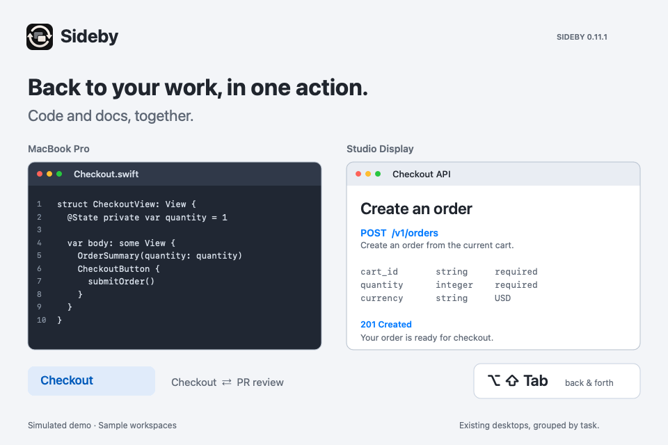
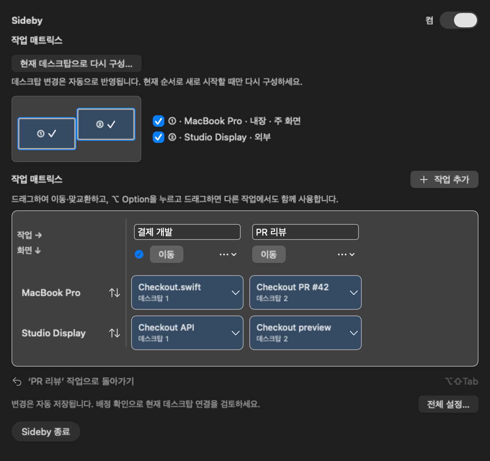
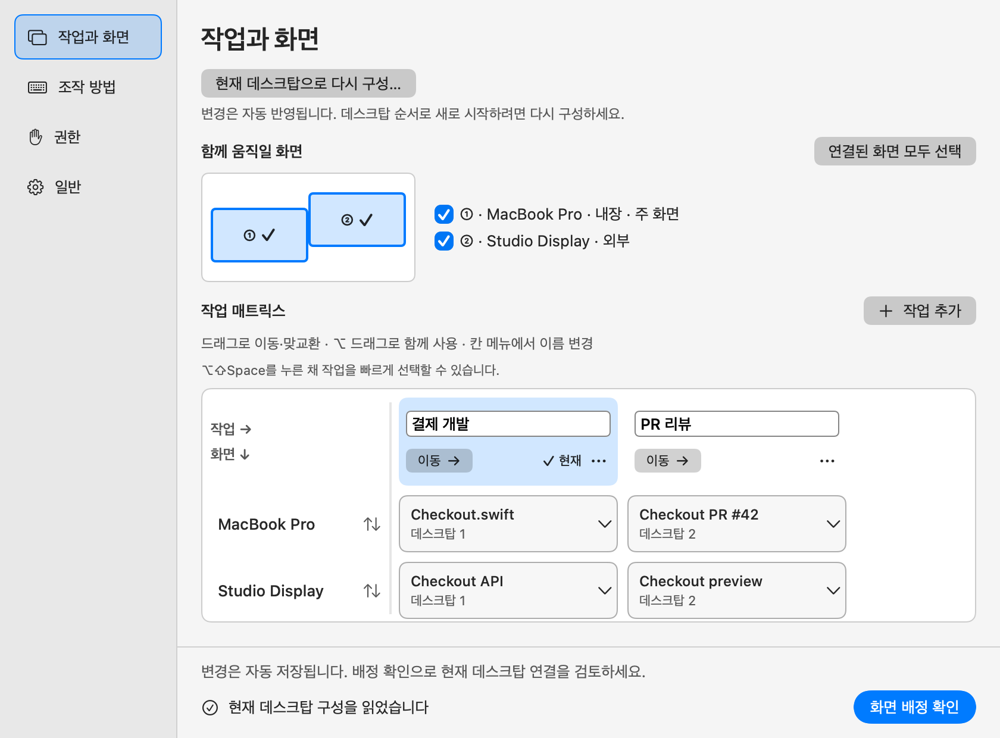
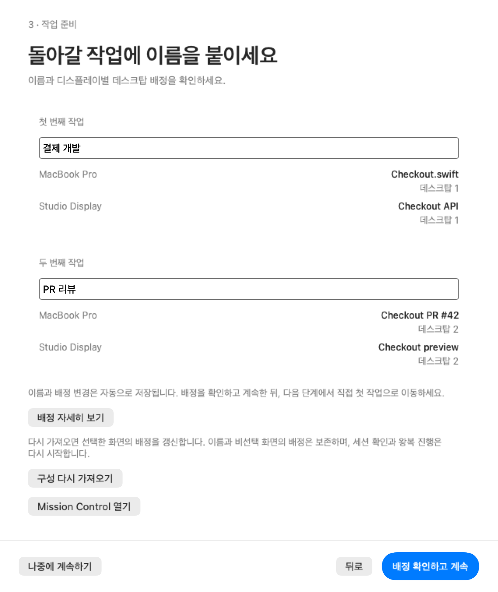
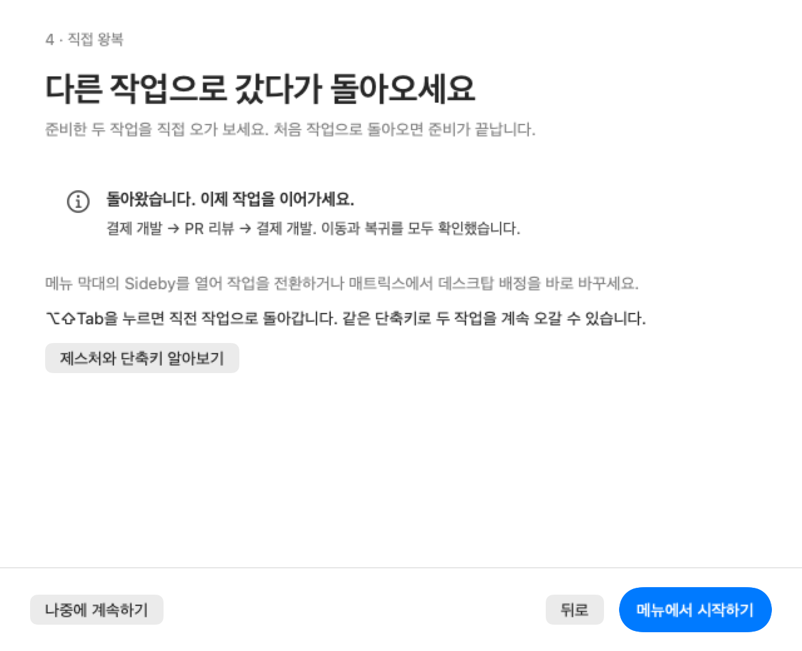

# Sideby

[English](README.md) | 한국어

**하던 작업으로 한 번에 돌아오세요.**

코드와 참고 문서를 **결제 개발**로 묶어 두고, 리뷰 요청이 오면 **PR 리뷰**로 전환하세요. Sideby는 Mac과 외부 화면의 데스크탑을 작업별로 묶어, 화면마다 따로 전환하지 않아도 하던 일을 이어가도록 돕습니다. 화면 하나만으로도 사용할 수 있습니다.

[Sideby 0.11.0의 새로운 기능](docs/releases/0.11.0.md)을 확인하세요.

<p align="center">
  
</p>

결제 개발 → PR 리뷰 → 결제 개발. 같은 `⌥⇧Tab` 단축키로 두 작업을 계속 오갈 수 있습니다. 데모는 샘플 데스크탑과 실제 Sideby 매트릭스 화면으로 제작했습니다. 화면 전환 애니메이션은 실제 모니터 녹화가 아닌 시뮬레이션입니다. [정지 이미지 보기](docs/images/sideby-demo-poster-en.png).

[Sideby 다운로드](https://github.com/ethznn/sideby/releases) · macOS 14 이상 · 한국어·영어 지원

## Sideby로 할 수 있는 일

- **작업에 필요한 화면을 함께 전환하세요.** 작업의 **이동** 버튼을 누르면 선택한 화면들이 각자 배정된 데스크탑으로 이동합니다.
- **같은 단축키로 돌아오세요.** `⌥⇧Tab`을 누르면 직전 작업으로 돌아갑니다. 다시 누르면 방금 작업으로 되돌아갑니다.
- **메뉴에서 바로 구성을 바꾸세요.** 메뉴 막대의 Sideby를 열면 매트릭스가 바로 보입니다. 작업 이름 수정, 화면 배정, 데스크탑 새로고침을 여기서 할 수 있습니다.

<p align="center">
  
</p>

*샘플 작업과 디스플레이 데이터를 넣어 렌더링한 실제 Sideby 화면입니다.*

## 내 작업에 맞게 매트릭스 조정하기

열은 작업, 행은 디스플레이입니다. 각 칸에는 해당 화면에 배정된 데스크탑이 표시되며, 읽을 수 있는 경우 콘텐츠 이름도 함께 나옵니다.

| 조작 | 결과 |
| --- | --- |
| 열 위쪽의 이름 수정 | 작업 이름을 바꿉니다. 전환할 때는 아래의 **이동** 버튼을 누릅니다. |
| 같은 디스플레이 행의 빈 칸으로 드래그 | 데스크탑 배정을 옮깁니다. |
| 같은 행의 채워진 칸으로 드래그 | 두 칸의 배정을 맞바꿉니다. |
| Option을 누른 채 같은 행의 빈 칸으로 드래그 | 원래 배정을 유지하고 다른 작업에서도 같은 데스크탑을 사용합니다. |
| 디스플레이 이름이나 상하 아이콘 드래그 | 화면 행 순서를 바꿉니다. |
| 각 칸의 메뉴 열기 | 드래그 없이 데스크탑을 배정합니다. 키보드로도 사용할 수 있습니다. |

**데스크탑 새로고침**은 메뉴 상단에 있습니다. 변경된 구성을 읽고, 지금 보고 있지 않은 데스크탑까지 화면별 콘텐츠 이름을 조회합니다. 이름은 앱·창에서 제공하는 정보로 제안하므로 macOS의 고유 Space 이름과는 다르며, 모든 이름을 읽을 수 있는 것은 아닙니다. 읽지 못하면 데스크탑 번호를 표시하고, 직접 수정한 작업 이름은 유지합니다.

화면 연결 변화는 자동으로 확인합니다. 연결이 끊긴 화면의 선택과 배정은 재연결을 위해 보관하며, 현재 사용할 수 있는 화면으로 작업을 이어갈 수 있습니다.

<details>
<summary>전체 ‘작업과 화면’ 설정 보기</summary>

**전체 설정 → 작업과 화면**에도 같은 매트릭스가 있습니다. 조작 방법·권한·일반 설정은 각 항목에서 관리합니다.

<p align="center">
  
</p>

</details>

## 처음으로 두 작업 왕복하기

1. **설치하고 권한을 확인하세요.** [GitHub Releases](https://github.com/ethznn/sideby/releases)에서 DMG를 내려받아 Sideby를 응용 프로그램으로 옮겨 실행합니다. 안내에 따라 손쉬운 사용과 화면 전환 접근 권한을 확인하세요.
2. **함께 움직일 화면을 고르세요.** 모니터 그림이나 체크박스를 누릅니다. 화면 하나로도 사용할 수 있지만, 왕복을 체험하려면 서로 다른 데스크탑 구성이 필요합니다. 데스크탑이 부족하면 Mission Control 안내를 따라 추가하세요.
3. **작업에 이름을 붙이세요.** 데스크탑 구성을 가져와 두 작업의 이름을 정하고, 화면별 콘텐츠 배정을 확인합니다.
4. **다른 작업에 갔다가 돌아오세요.** 안내의 버튼으로 다른 작업에 이동한 뒤 처음 작업으로 돌아옵니다. 완료 후 **메뉴에서 시작하기**를 누르세요. 이후에는 단축키나 제스처도 사용할 수 있습니다.

안내는 나중에 이어서 진행할 수 있습니다. 실제 왕복이 성공해야 완료되며, 건너뛰거나 이동에 실패한 경우에는 완료로 기록하지 않습니다.

<details>
<summary>작업 준비와 왕복 완료 화면 보기</summary>

<p align="center">
  
</p>

<p align="center">
  
</p>

완료 상태를 포함해 샘플 데이터를 넣은 실제 앱 화면입니다.

</details>

## 단축키와 제스처

| 입력 | 동작 |
| --- | --- |
| `⌥⇧Tab` | 직전 작업으로 돌아갑니다. 반복해서 누르면 최근 두 작업을 오갑니다. |
| `⌥⇧1` … `⌥⇧9`, `⌥⇧0` | 1~10번째 작업으로 이동합니다. |
| `⌥⇧<` / `⌥⇧>` | 이전 / 다음 작업으로 이동합니다. |
| Option + Shift + 가로 스와이프 | 기본 제스처로 전환합니다. |

키보드로 전환할 때는 조합을 누른 뒤 Option과 Shift를 모두 떼면 이동합니다. 제스처 옵션은 조작 방법 설정에서 확인할 수 있습니다.

## 화면 구성이 바뀌었을 때

Sideby는 현재 데스크탑 구성을 읽고 요청한 이동을 확인합니다. 메뉴를 열거나 **데스크탑 새로고침**을 누르면 전체 설정 창에 들어가지 않고 변경된 구성을 반영할 수 있습니다. 앱을 다시 켰다고 매번 저장된 배정을 확인할 필요는 없습니다.

일부 화면이 이동하지 못했다면 아직 목적지에 도착하지 않은 화면만 다시 시도할 수 있습니다. 필요한 데스크탑이 없어졌거나 구성을 읽지 못하면 메뉴에서 새로고침 또는 배정 확인 방법을 안내합니다.

작업은 기존 macOS 데스크탑을 연결한 것입니다. 앱과 문서를 다시 열거나 창 내용·위치를 복원하지는 않습니다. 작업을 삭제해도 Sideby의 배정만 지워지며 실제 macOS 데스크탑은 삭제되지 않습니다.

## 개인정보와 플랫폼 안내

Sideby는 설정한 전역 제스처를 감지하고, 가능한 경우 앱·창의 이름을 제안하는 데 손쉬운 사용 접근 권한을 사용합니다. 화면 전환 접근 권한은 요청한 데스크탑 이동 명령을 보내는 데 필요합니다. 일부 명령 경로에는 System Events 자동화 권한도 필요합니다. 전환과 데스크탑 구성 조회는 화면 기록 권한을 요청하지 않습니다.

전역 키보드 단축키는 고정된 `Option + Shift + 숫자 / < / > / Tab` 조합만 등록합니다. 다른 키 입력은 검사하거나 저장하지 않습니다. 데스크탑 조회는 macOS 구성을 읽기만 하며, 비공개 Space ID·창 ID·원시 입력 이벤트·스크린샷은 저장하지 않습니다.

작업 이름과 배정, 화면 선택과 행 순서, 기억한 화면 이름, 조작 설정과 안내 진행 상태는 Mac에 로컬로 저장합니다. 콘텐츠 제안을 작업 이름으로 사용하면 해당 이름도 저장됩니다.

직접 배포 앱은 App Sandbox를 끈 상태에서 비공개 SkyLight API를 사용하며, Mac App Store 배포를 목표로 하지 않습니다. Sparkle 2로 업데이트를 제공하고 사용자가 승인하면 설치합니다.

## 개발

Swift 6 도구 모음이 포함된 Xcode에서 `Package.swift`를 열거나 다음 명령을 실행합니다.

```bash
swift test
swift build --product SidebyApp
swift build --product SidebyDevApp
```

`SidebyApp`은 제품 앱, `SidebyDevApp`은 로컬 진단과 API 실험용 앱입니다. 직접 확인할 앱 번들을 만들 때는 공개 [Sparkle 피드](https://github.com/ethznn/sideby/releases/latest/download/appcast.xml)의 최신 `sparkle:version`에 1을 더한 값을 `SIDEBY_BUILD_NUMBER`로 지정하고 `scripts/build_app_bundle.sh`를 실행하세요. 공개 배포 이후에는 스크립트의 기본 빌드 번호를 사용하지 않습니다.

README 이미지와 시뮬레이션 데모는 `bash scripts/render_readme_demo.sh`로 다시 만들 수 있습니다. 실제 외부 화면 없이 별도 샘플 데이터를 사용합니다. 자세한 내용은 [미디어 원본과 재생성 방법](docs/media/README.md)을 참고하세요.

### 아키텍처

- `SidebyApp`: 메뉴 막대, 창, 제품 온보딩과 앱 흐름.
- `SidebyCore`: 순수 Swift로 작성한 작업·제스처·설정·복구 규칙.
- `SidebySystem`: macOS 입력·디스플레이·구성 조회·명령 어댑터.
- `SidebyUI`: 재사용 SwiftUI 뷰와 뷰 모델.
- `SidebyDevApp` / `SidebyDevSupport`: 로컬 진단과 실험.

Space 전환은 `ContextSwitchEngine`과 `SpaceCommandExecutor`를 거칩니다. 재사용 화면은 SwiftUI가 맡고, 메뉴 막대·창·시스템 연동은 AppKit이 처리합니다.

구현 및 배포에 관한 내용은 [Development](docs/DEVELOPMENT.md)와 [Decisions](docs/DECISIONS.md)를 참고하세요.

## 기여·보안·라이선스

이슈나 pull request를 열기 전에 [CONTRIBUTING.md](CONTRIBUTING.md)를 읽고, 코드 변경 시 `swift test`를 실행해 주세요. 권한·입력·전환·패키징·배포 변경은 먼저 이슈에서 논의해 주세요.

보안 취약점은 공개 이슈 대신 [SECURITY.md](SECURITY.md)의 절차로 제보해 주세요. Sideby는 [MIT License](LICENSE)로 배포됩니다.
