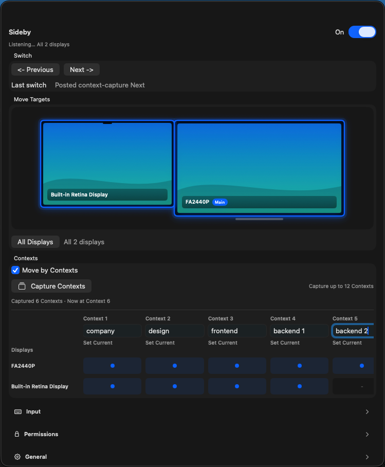
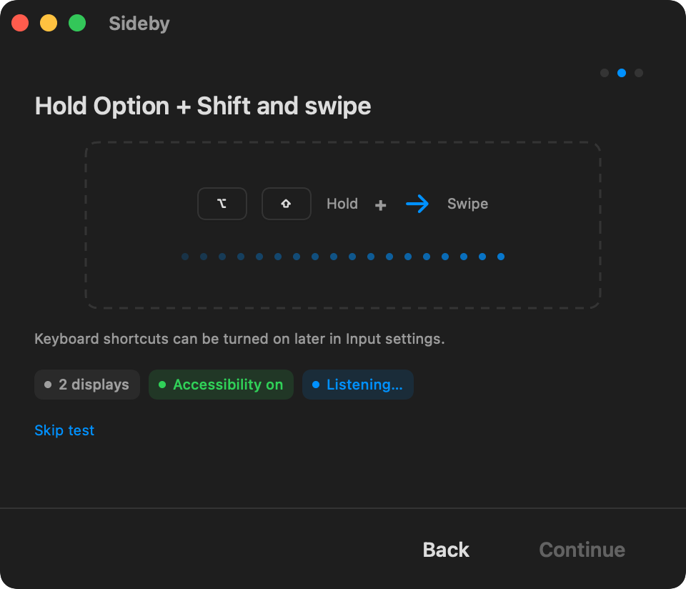

# Sideby

[English](README.md) | [한국어](README.ko.md)

Sideby is a native macOS menu bar utility for people who work across multiple displays and want to switch a whole work context together. Its product slogan is "Side by Side."

Sideby does not replace Mission Control and is not a full window manager. It focuses on a narrow workflow: choose the displays that should move together, turn Sideby on, then use a gesture or optional shortcut to move to the previous or next macOS Space.

## Preview





## Why Sideby Exists

Sideby started from a simple way of organizing work: keep one context spread across multiple displays, with each screen holding a useful part of the same task. When the context changes, those screens should move together instead of being switched one display at a time.

The goal is to make a multi-display setup feel like one workspace that can move as a set. Sideby keeps the scope small and explains permission or Space limitations clearly instead of pretending that macOS exposes perfect control over every display.

## Status

Sideby is pre-1.0 software. Version 0.4.0 focuses on more flexible Context mapping: instant Context Capture can preserve per-display Space positions, a display can be absent from a Context in the middle of the captured set, Contexts can be opened directly from the matrix, display rows can be reordered, and Move by Contexts / Align Displays use captured per-display indexes instead of assuming every display uses the same Space order.

The current release strategy is direct distribution with App Sandbox off. Context Capture and Align Displays use a read-only SkyLight layout query when it is available, with a slower public-command fallback for capture. This means Sideby is not targeting Mac App Store distribution.

## Features

- Menu bar app with a resizable settings popover for quick control across multiple displays.
- Named Contexts for workspaces that span one or more displays.
- Context matrix for reviewing which displays belong to each Context, including each display's captured Space number and user-defined display row order.
- Instant Capture Contexts flow for building a Context set from the current display/Space arrangement, with a walk-based fallback when the layout query is unavailable.
- Context Capture can preserve gaps when displays have different current Space positions, so display membership does not need to be contiguous from Context 1.
- Context Capture skips mirrored displays or displays without an independent Space layout when other selected displays can still be captured.
- Move Targets for selecting which displays should switch together in general movement mode.
- Move by Contexts for switching displays to the next or previous captured Context using per-display target Space indexes.
- Direct Context activation from the matrix for jumping to a named Context.
- Drag display Space positions in the Context matrix to adjust captured membership, and drag display rows to reorder the matrix.
- Align Displays for bringing the selected displays back to the Context represented by the reference display's current Space, with on-display feedback when a display is already aligned or not part of that Context.
- Previous/Next Screen Switching through public macOS keyboard-command paths.
- Default input habit: `Option + Shift + horizontal swipe`.
- Optional Previous/Next keyboard shortcuts from the menu bar settings popover.
- Best-effort fallback to general movement when external Space changes make Context matching unsafe.
- Center-screen Context HUD when switching with Move by Contexts.
- First-run onboarding for Accessibility and Screen Switching access.
- Diagnostics for permission, display, and switching limitations.
- Display Spaces labels and best-effort visible app/window suggestions.
- English and Korean UI copy.

## Requirements

- macOS 14 or later.
- Xcode with a Swift 6 toolchain.
- Accessibility permission for global input detection.
- Screen Switching access for posting the requested Space switch command.
- System Events Automation permission when the current V1 command path needs it.

Sideby does not request Screen Recording for Screen Switching, Context Capture, or Align Displays.

## Quick Start

Download the latest signed and notarized DMG from [GitHub Releases](https://github.com/ethznn/sideby/releases).

Clone the repository, run the tests, then build the local product bundle:

```bash
swift test
scripts/build_app_bundle.sh
open "dist/Sideby.app"
```

After opening the app, grant the requested Accessibility and Screen Switching permissions in macOS system settings (`macOS 시스템 설정`). If you rebuild the bundle and macOS still reports a permission as denied, remove the old Sideby entry from `macOS 시스템 설정` and add the rebuilt app again.

For development and macOS API experiments, build the dev app:

```bash
scripts/build_dev_app_bundle.sh
open "dist/SidebyDevApp.app"
```

`SidebyDevApp` is a local test harness. It is not the release bundle.

## Development

Open the Swift package directly in Xcode:

```bash
xed Package.swift
```

Use the `SidebyApp` scheme for the product app and `SidebyDevApp` for the local dev harness.

Common commands:

```bash
swift test
swift build --product SidebyApp
swift build --product SidebyDevApp
scripts/build_app_bundle.sh
scripts/build_dev_app_bundle.sh
```

The product bundle uses `Resources/AppIcon.icns`. When replacing source artwork, regenerate the icon before building:

```bash
swift scripts/generate_app_icon.swift <source-png> Resources/AppIcon.icns
scripts/build_app_bundle.sh
```

## Architecture

The repository is split into small SwiftPM modules:

```text
Sources/
  SidebyApp/       product app, menu bar, panels, onboarding
  SidebyDevApp/    local probes and diagnostics
  SidebyDevSupport/ local probe helpers used by SidebyDevApp
  SidebyCore/      domain models, gesture logic, settings, diagnostics
  SidebySystem/    macOS API adapters
  SidebyUI/        reusable SwiftUI views and view models
Tests/
  SidebyCoreTests/
  SidebySystemTests/
  SidebyUITests/
```

Important boundaries:

- Space switching goes through `ContextSwitchEngine` and `SpaceCommandExecutor`.
- Global input adapters stay in `SidebySystem`.
- Gesture interpretation stays in pure Swift domain logic under `SidebyCore`.
- SwiftUI owns reusable UI, while AppKit adapters handle menu bar, window, and system integration details.

See [docs/DEVELOPMENT.md](docs/DEVELOPMENT.md) for setup notes and [docs/DECISIONS.md](docs/DECISIONS.md) for the small set of technical boundaries that protect users.

## Privacy

Sideby uses Accessibility permission to detect the configured gesture while Sideby is on. It uses Screen Switching access to send the requested previous/next Space command after the user acts.

Sideby reads the current per-display Space layout at runtime when macOS makes it available, but it does not store private Space IDs or hidden Mission Control state. Sideby does not store typed input, raw input events, screenshots, app bundle IDs, or window IDs. Context definitions, display membership, captured per-display Space indexes, display row order, shortcut settings, and user-authored labels are stored locally.

## Documentation

- [Development](docs/DEVELOPMENT.md)
- [Decisions](docs/DECISIONS.md)

## Contributing

Contributions are welcome. Please read [CONTRIBUTING.md](CONTRIBUTING.md) before opening an issue or pull request.

For code changes, run `swift test` before submitting. For permission, input, switching, packaging, or release-sensitive changes, open an issue first so the tradeoffs can be discussed.

## Security

Please do not report security vulnerabilities through public issues. See [SECURITY.md](SECURITY.md) for the reporting process.

## License

Sideby is released under the [MIT License](LICENSE).
