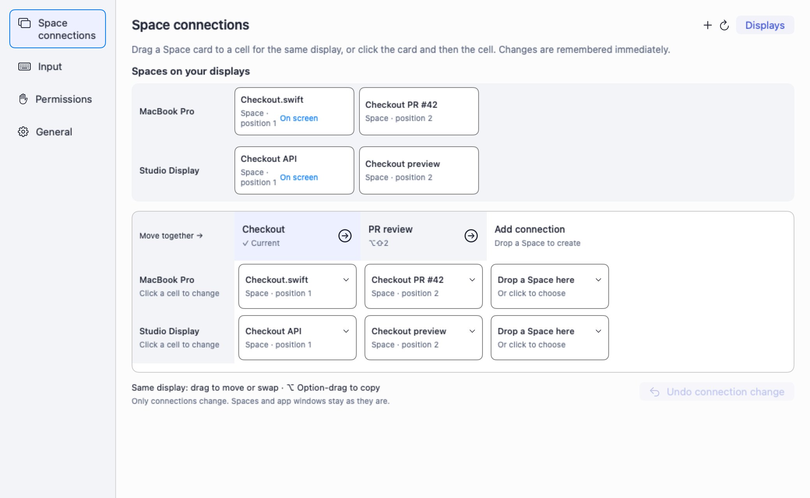

# Sideby

English | [한국어](README.ko.md)

[Website](https://ethznn.github.io/sideby/) · [Download](https://github.com/ethznn/sideby/releases/latest)

**Move your Spaces together.**

Connect the Spaces you already use across your displays. When your environment changes, see what is open and adjust the matching cell in Settings. No names or separate saves are required.

<p align="center">
  
</p>

*22.5-second motion graphic with fictional data. Illustrated workflow, not an app capture or a switching benchmark.*

[Still image](docs/images/sideby-connections-film-en.png) · [Preview with playback controls](docs/media/preview.html)

*Sideby 1.0.2 · [What’s new](docs/releases/1.0.2.md).*

## See and connect in one window

<p align="center">
  
</p>

*Actual app view with fictional data.*

1. Open **Sideby in the menu bar → Settings**. It opens directly to **Space connections**.
2. Review the Spaces above the table. Available app/window titles, Space positions, and **On screen** markers show what is open.
3. Drag a Space into an empty cell for the same display to make your first connection. You can also click a Space, then a cell. Changes are remembered immediately. Use **Undo** or `⌘Z` to step back through the last 20 changes, including after restarting Sideby.

Spaces in the same column switch together. You can also click a cell to choose directly.

- **Create a connection:** Drop a Space into a blank cell in the **Add connection** column. The + button scrolls to this column.
- **Move or swap:** Drag between cells for the same display. Move into an empty cell or swap two occupied cells.
- **Copy:** **Hold ⌥ Option when dropping** to keep the source cell. Dragging from the Space list also keeps the list intact.
- **Undo:** **Undo** restores both cells in one step.

To clear one cell, click it and choose **Disconnect this cell**. Use **… → Clear connections for this display…** beside a display name to clear just that row. Connections for disconnected displays can also be cleared; other displays' connections are kept. Use a column heading's **…** or right-click menu to reorder or remove a column.

To remove several columns together, choose **Select connections** at the table's top left. Click headings or cells to select their columns, then choose **Remove N selected…** and confirm. You can also **Select all**. **Cancel** leaves your connections unchanged and exits selection mode. One **Undo** restores the removed columns together. Clicking cells in selection mode does not edit connections or switch Spaces.

To start over, choose **Clear all connections…** and confirm. This also clears connections for disconnected displays. The actual Spaces and app windows stay open. Empty cells remain available so you can immediately create a new connection. If you change your mind while rebuilding, use **Undo** repeatedly to go back. Clearing all connections counts as one of the last 20 changes.

Click **Move together** below a column heading to move your screens. Filled cards show connected Spaces; dashed **+** cells are available for a connection. Use **Add connection** to reveal the blank column, or the **…** menu to reorder or remove a connection. Editing a cell or dragging a desktop does not switch screens. Displays excluded from switching remain where they are.

## Get started

1. Download the DMG from [GitHub Releases](https://github.com/ethznn/sideby/releases), move Sideby to Applications, and open it.
2. Allow Accessibility and Screen Switching access in the guide.
3. Choose Spaces in the empty cells to make a connection. You can also choose **Connect in current order** to pair Spaces at the same positions across selected displays. Naming, saving, and switching practice are not required.

Existing connections, names, and numbered shortcuts are kept. No recreation or deletion is required. If you have an unsaved draft in an older editor, finish it before changing connections here.

## Daily use

Hold `⌥⇧Space` to open the switcher with your current connection in view. **Click anywhere in a column** to move the connected desktops together. Choose **Edit connections** only when you need to change them; the panel shows **Spaces on your displays** above the connection table. Drag a card to a cell for the same display, or click the card and then the cell. Edits are immediate, and **Back to switching** returns within the same panel. **Settings** shows the same list and connection table. The menu-bar table still allows direct cell editing.

| Input | Action |
| --- | --- |
| Hold `⌥⇧Space` | Open the switcher near the pointer. Click a column to move. |
| `⌥⇧Tab` | Return to the last connection you visited. |
| `⌥⇧1` … `⌥⇧9`, `⌥⇧0` | Move to the connection assigned that number. Deleting another connection keeps existing numbers. |
| `⌥⇧<` / `⌥⇧>` | Move to the previous / next connection. |
| Option + Shift + horizontal swipe | Move displays together with the default gesture. |

Numbered, previous/next, and return shortcuts execute when Option and Shift are released. The held connection table closes on key release. Choosing **Edit connections** keeps it open so you can release the keys; dismiss it with Escape or the close button. Configure inputs in **Settings → Input**.

## When your environment changes

Connections follow the same surviving desktops when their order changes. A missing desktop is marked **Choose again**; Sideby never substitutes another desktop at the same position. New desktops appear in the upper list for you to connect. Disconnected displays keep their connections; use **Show disconnected displays** to see them.

**Space** refers to a macOS workspace, including regular desktops and full-screen apps. **Space · position 3** means its position in that display’s list, not a Mission Control name such as “Desktop 3.” Available app/window names are shown first.

While the connection editor is visible, Space lists and available app/window titles update automatically. If Spaces cannot be read, use **Read again** after checking the display connection. Custom desktop names take priority. These labels do not rename Mission Control desktops. If writing settings fails, Sideby reports the problem and keeps the existing connections.

Sideby connects and switches existing Spaces. It does not create or delete desktops, launch apps, put them into full screen, or restore window positions.

## Privacy and platform notes

Sideby uses Accessibility for its configured global gesture and available app/window title suggestions. Screen Switching access allows the requested desktop-switch commands; some paths also need System Events Automation. Switching and desktop discovery do not request Screen Recording permission.

Setup names, desktop connection bookmarks, custom desktop names, display choices, shortcut assignments, undo data, migration backups, input preferences, and guide progress stay locally on your Mac. Runtime numeric Space IDs, window IDs, raw input events, and screenshots are not saved. Sideby does not save typed input from its global shortcut handling.

The direct-distribution app uses private SkyLight APIs with App Sandbox off. Updates use Sparkle 2, with user-approved installation. The update window follows your selected app language after Sideby is reopened; release notes are in English.

## Development

Open `Package.swift` in Xcode with a Swift 6 toolchain, or run:

```bash
swift test
swift build --product SidebyApp
swift build --product SidebyDevApp
```

`SidebyApp` is the product; `SidebyDevApp` is a local probe. Before a local app bundle build, read the published [Sparkle feed](https://github.com/ethznn/sideby/releases/latest/download/appcast.xml) and set `SIDEBY_BUILD_NUMBER` to the latest `sparkle:version` plus one when running `scripts/build_app_bundle.sh`.

See [Development](docs/DEVELOPMENT.md), [Decisions](docs/DECISIONS.md), and [README media](docs/media/README.md). Native documentation views use isolated sample data. The repository contains GIF previews and still images; full MP4 exports stay local.

## Contributing, security, and license

Read [CONTRIBUTING.md](CONTRIBUTING.md) before opening an issue or pull request. Report vulnerabilities through [SECURITY.md](SECURITY.md). Sideby is released under the [MIT License](LICENSE).
