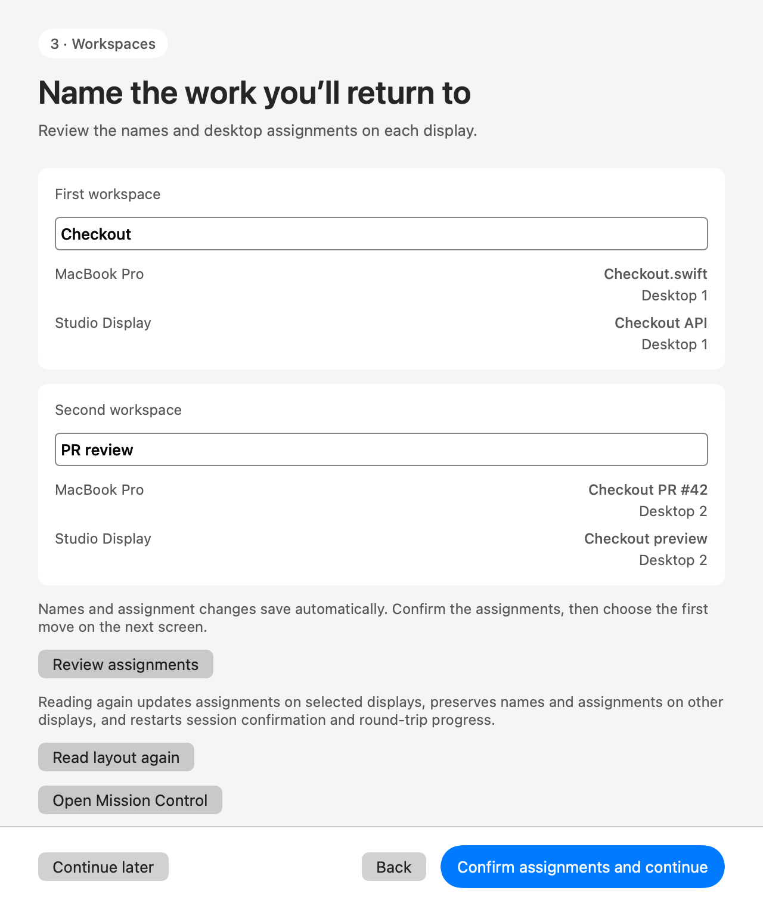
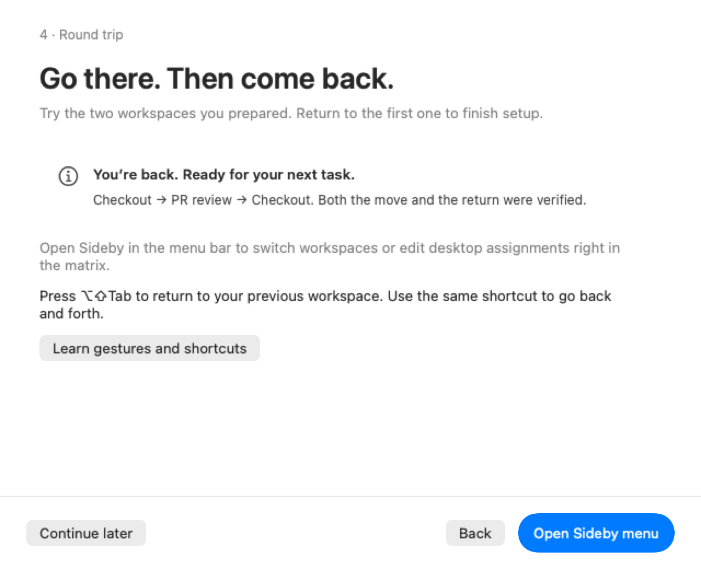

# Sideby

English | [한국어](README.ko.md)

**Back to your work, in one action.**

Keep code and reference material together as **Checkout**, then switch to **PR review** when a review comes in. Sideby groups the desktops on your Mac and external displays into named workspaces, so you can return without switching every screen yourself. It also works with a single display.

See [what’s new in Sideby 0.11.1](docs/releases/0.11.1.md).

<p align="center">
  
</p>

Checkout → PR review → Checkout, using the same `⌥⇧Tab` shortcut to go back and forth. The demo uses sample desktops and a capture of Sideby’s actual matrix; the animated desktop transitions are a simulation, not a hardware recording. [View the still image](docs/images/sideby-demo-poster-en.png).

[Download Sideby](https://github.com/ethznn/sideby/releases) · macOS 14 or later · English and Korean

## What you can do

- **Switch a whole task.** Choose a workspace’s **Go** button to move its assigned desktops on the selected displays.
- **Return with the same shortcut.** Press `⌥⇧Tab` to return to the previous workspace. Press it again to switch back.
- **Arrange work from the menu.** Open Sideby in the menu bar to see the matrix immediately. Rename workspaces, change assignments, or rebuild from the current desktop order there.

<p align="center">
  
</p>

*Actual Sideby interface rendered with sample workspaces and display data.*

## Make the matrix yours

Columns are workspaces. Rows are displays. Each cell shows that display’s assigned desktop, including a content label when one is available.

| Action | Result |
| --- | --- |
| Edit the name at the top of a column | Rename that workspace. Use **Go** below it to switch. |
| Drag a cell to an empty cell in the same display row | Move the desktop assignment. |
| Drag a cell onto an occupied cell in the same row | Swap the two assignments. |
| Hold Option and drag to an empty cell in the same row | Keep the original assignment and use that desktop in another workspace too. |
| Drag a display’s name or up/down icon | Reorder display rows. |
| Open a cell’s menu | Assign a desktop without dragging, including with the keyboard. |

Desktop changes are detected automatically. To start over, choose **Rebuild from current desktops…** at the top of the menu or Workspaces & Displays settings. Sideby confirms how many workspaces it will create, then replaces the selected displays’ names and assignments in current desktop order. This also replaces custom swaps and shared-desktop assignments. Other displays’ assignments are kept separately. **Restore previous setup** brings back the last saved configuration when its desktops are still available.

New names use available app/window content from each display’s desktops, including desktops you are not currently viewing. These are suggestions, not native macOS Space names; Sideby falls back to a desktop number when metadata is unavailable. Names you edit yourself are preserved during routine updates, but an explicit rebuild creates fresh names.

Display connection changes are checked automatically. Disconnected display choices and assignments are retained for reconnection; you can continue working with the selected displays that are currently available.

<details>
<summary>See the full Workspaces & Displays settings</summary>

The same matrix is available in **All settings → Workspaces & Displays**. Input, Permissions, and General settings have their own panes.

<p align="center">
  
</p>

</details>

## Your first round trip

1. **Install and allow access.** Download the DMG from [GitHub Releases](https://github.com/ethznn/sideby/releases), move Sideby to Applications, and open it. Follow the guide for Accessibility and Screen Switching access.
2. **Choose your displays.** Click the display diagram or checkboxes. One display is enough; a round trip needs two different desktop arrangements. The guide points you to Mission Control if more desktops are needed.
3. **Name your workspaces.** Read the desktop arrangement, name two workspaces, and check which content belongs to each display.
4. **Go there, then come back.** Follow the guide’s buttons to visit the other workspace and return. Finish with **Open Sideby menu**. You can use shortcuts or gestures afterward.

You can continue the guide later. Its completion is based on a successful round trip; a skipped step or a failed move does not count.

<details>
<summary>See workspace preparation and the completed round trip</summary>

<p align="center">
  
</p>

<p align="center">
  
</p>

These are production views rendered with sample data, including a simulated completed guide.

</details>

## Shortcuts and gestures

| Input | Action |
| --- | --- |
| `⌥⇧Tab` | Return to the previous workspace; repeat to alternate between the last two. |
| `⌥⇧1` … `⌥⇧9`, `⌥⇧0` | Go to workspace positions 1–10. |
| `⌥⇧<` / `⌥⇧>` | Previous / next workspace. |
| Option + Shift + horizontal swipe | Switch with the default gesture. |

For keyboard switching, press the combination, then release Option and Shift to execute the move. Input settings explain the available gesture options.

## When your setup changes

Sideby reads the live desktop layout and checks requested moves. Routine additions, removals, and reordered desktops are reflected automatically while the matrix is open and checked before switching. Saved workspaces follow the same surviving desktops across an app restart; reordering desktops does not reset custom workspace assignments. Workspaces that only use disconnected displays are hidden from the everyday matrix and do not take a shortcut position.

If an older version’s assignments already point at the wrong desktops, use **Rebuild from current desktops…** once to start again in the current order. Older versions did not save enough identity information to recover a desktop’s previous position after the fact.

If a move is incomplete, Sideby can retry the displays that have not reached the destination. If a required desktop is missing or its layout cannot be read, check the assignment in the menu, or rebuild to start over. The previous setup stays saved if a desktop needed for restoration is missing.

Workspaces refer to existing macOS desktops. Sideby does not reopen documents or restore window contents and positions. Deleting a workspace removes its Sideby assignments, never the macOS desktops themselves.

## Privacy and platform notes

Sideby uses Accessibility for its configured global gesture and, when available, app/window title suggestions. Screen Switching access allows it to send the requested desktop-switch commands. Some command paths also need System Events Automation. Switching and desktop discovery do not request Screen Recording permission.

The fixed global keyboard registrations cover only `Option + Shift + number / < / > / Tab`. Sideby does not inspect or store other typed input. Runtime desktop discovery uses read-only macOS layout queries. Numeric runtime Space IDs, window IDs, raw input events, and screenshots are not saved. Minimal desktop identity bookmarks are stored locally so assignments can follow the same desktops after a restart.

Workspace names and assignments, the previous setup saved before a rebuild, display choices and row order, remembered display names, input preferences, and guide progress stay locally on your Mac. A content suggestion used as a workspace name becomes part of that saved name.

The direct-distribution app uses private SkyLight APIs with App Sandbox off; it is not targeting the Mac App Store. Updates are delivered through Sparkle 2, with user-approved installation.

## Development

Open `Package.swift` in Xcode with a Swift 6 toolchain, or run:

```bash
swift test
swift build --product SidebyApp
swift build --product SidebyDevApp
```

`SidebyApp` is the product. `SidebyDevApp` is a local probe and API test harness. To build an app bundle for manual verification, check the published [Sparkle feed](https://github.com/ethznn/sideby/releases/latest/download/appcast.xml) and run `scripts/build_app_bundle.sh` with `SIDEBY_BUILD_NUMBER` set to the latest `sparkle:version` plus one. Do not use the script’s default build number after a public release exists.

Regenerate the README screenshots and simulated demo with `bash scripts/render_readme_demo.sh`. This uses isolated sample data and does not need real external displays. See [media sources and reproduction](docs/media/README.md).

### Architecture

- `SidebyApp`: menu bar, windows, product onboarding, and application coordination.
- `SidebyCore`: pure Swift workspace, gesture, settings, and recovery rules.
- `SidebySystem`: macOS input, display, layout, and command adapters.
- `SidebyUI`: reusable SwiftUI views and view models.
- `SidebyDevApp` / `SidebyDevSupport`: local probes and diagnostics.

Space switching goes through `ContextSwitchEngine` and `SpaceCommandExecutor`. SwiftUI owns reusable interfaces; AppKit handles menu bar, window, and system integration.

See [Development](docs/DEVELOPMENT.md) and [Decisions](docs/DECISIONS.md) for implementation and distribution details.

## Contributing, security, and license

Read [CONTRIBUTING.md](CONTRIBUTING.md) before opening an issue or pull request, and run `swift test` for code changes. Discuss changes involving permissions, input, switching, packaging, or distribution in an issue first.

Report vulnerabilities through the process in [SECURITY.md](SECURITY.md), not a public issue. Sideby is released under the [MIT License](LICENSE).
