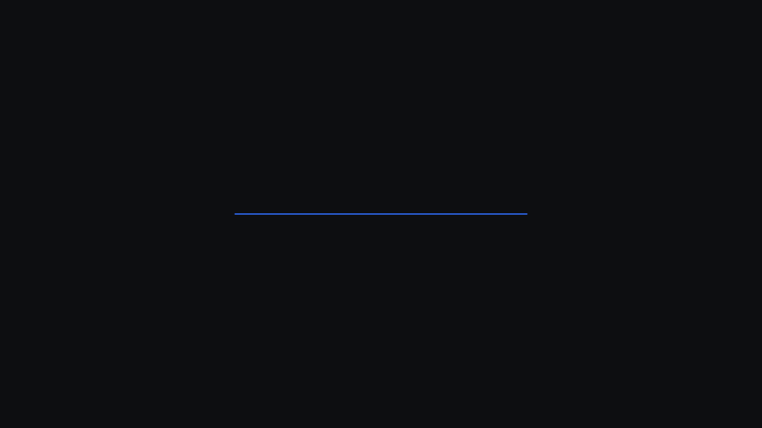
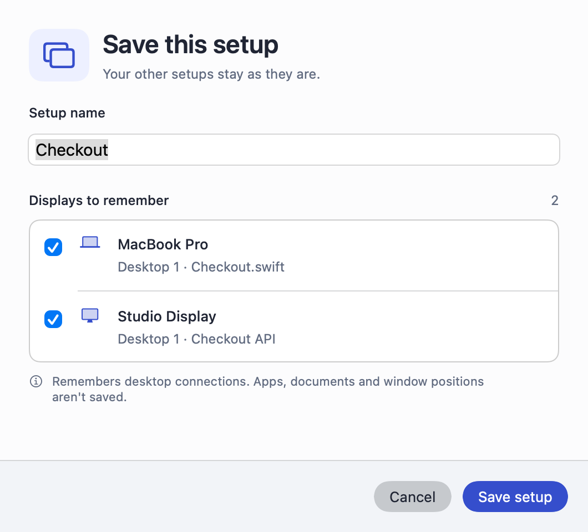
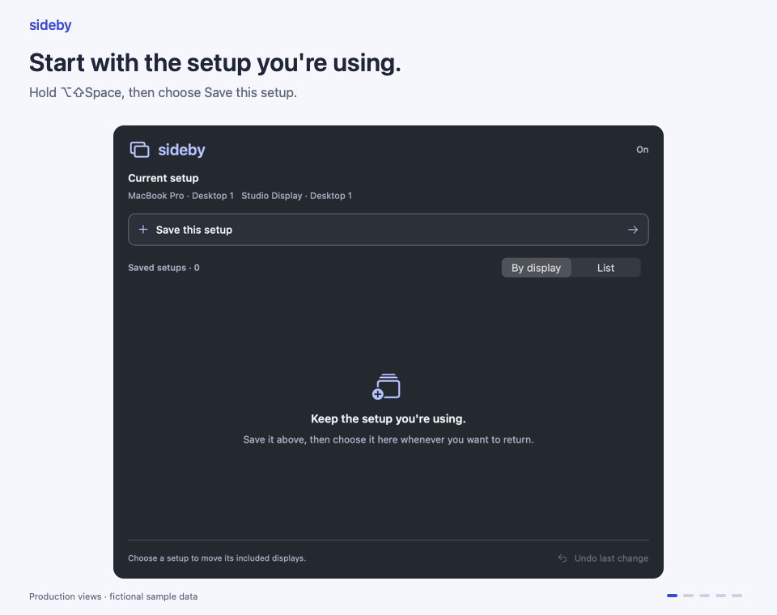
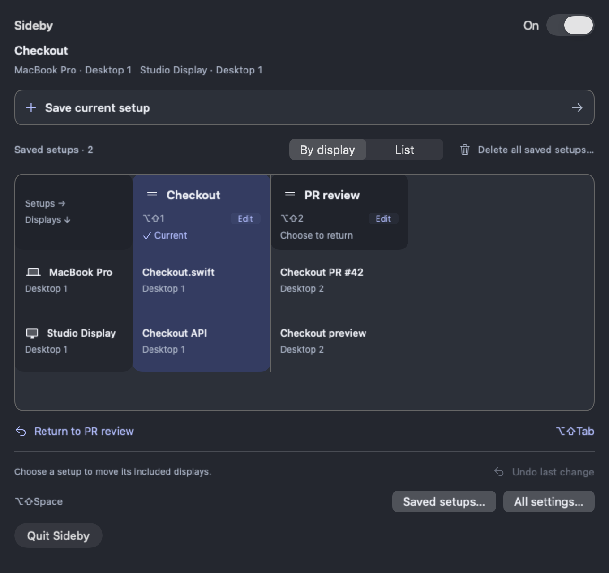
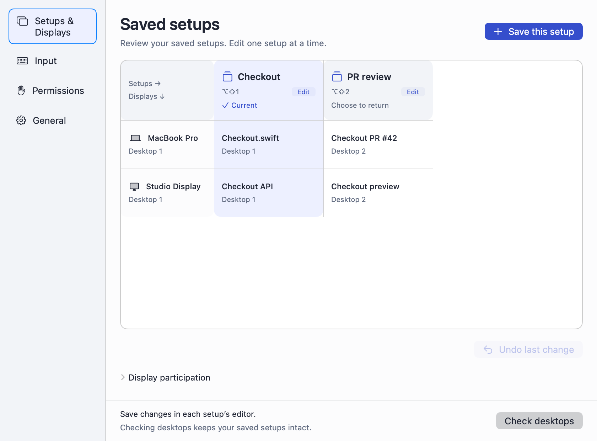
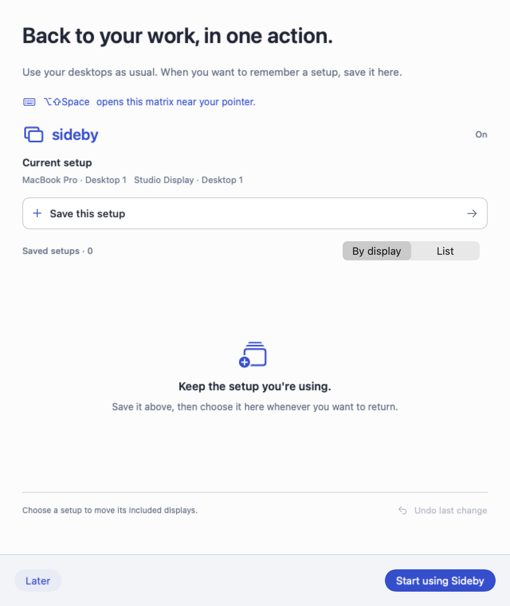

# Sideby

English | [한국어](README.ko.md)

**Back to your work, in one action.**

<p align="center">
  
</p>

Save the desktops you're using across your displays as a setup. Choose it later to switch those displays together. One display works too.

*Illustrated desktops and a simplified save form with fictional data. Motion explains the workflow, not measured switching speed.* [Still image](docs/images/sideby-kinetic-en.png).

[Download Sideby](https://github.com/ethznn/sideby/releases) · macOS 14 or later · English and Korean

[Sideby 0.13.0](docs/releases/0.13.0.md) introduces saving the current setup, individual setup editing, undo, and a refreshed interface that follows your Mac’s light or dark appearance.

## Save while you work

1. **Arrange your desktops as usual.** Open the work you need on each display.
2. **Hold `⌥⇧Space` and choose “Save this setup.”** Release the shortcut, enter a name, check the displays to remember, and save.
3. **Choose that setup when you need it again.** Its included displays move together. Press `⌥⇧Tab` to return to the previous setup.

Start with one useful setup and add another when you actually use it. A new installation begins with an empty list. Saving adds one setup and preserves everything you already saved.

<p align="center">
  
</p>

Sideby remembers connections to existing macOS desktops. It does not capture screenshots, reopen apps or documents, or restore window positions.

<details>
<summary>See the save flow in the actual app</summary>

<p align="center">
  
</p>

Production views with fictional sample data: save a first setup, add another, and choose it again. [Still image](docs/images/sideby-save-flow-en.png).

</details>

## Choose and adjust a setup

Columns are saved setups; rows are currently connected displays. Choose a setup column to switch. You can also use **List** when you prefer a compact view.

<p align="center">
  
</p>

| Action | Result |
| --- | --- |
| **Save this setup** | Add the current desktop combination under a new name. An identical saved setup is pointed out instead of added twice. |
| A setup’s **Edit** action | Rename it, include or exclude a display, or choose another desktop. Only that setup changes. |
| **Use current setup** in the editor | Update the draft to the desktops now in use. Review the changes before saving. |
| **Undo last change** | Restore the last setup addition, edit, or deletion. One undo is retained across app restarts until the next setup change. |
| **Delete all saved setups…** | Confirm removal of the saved list, including setups on disconnected displays. Actual desktops, apps, and other settings remain. You can undo the deletion. |

Disconnected displays do not add rows to the everyday matrix. Their saved connections remain in setup editing and return when the displays reconnect. Saving a new setup includes only the available displays you select.

<details>
<summary>Setups & Displays settings</summary>

Open **All settings → Setups & Displays** for display selection and the same saved setup browser. **Check desktops** rereads the current layout without recreating or replacing your setups. Input, Permissions, and General each have their own pane.

<p align="center">
  
</p>

</details>

## Get started

1. Download the DMG from [GitHub Releases](https://github.com/ethznn/sideby/releases), move Sideby to Applications, and open it.
2. Follow the guide to check Accessibility and Screen Switching access and select your displays.
3. Save your first setup from the matrix. Use Mission Control to prepare another desktop setup, then save that one too.
4. Choose a saved setup to go there; use `⌥⇧Tab` to come back.

**Upgrading from an earlier version?** Existing setups are kept, including entries that older versions created automatically. They are not newly generated by 0.13.0. To start with your own saved setups, use **Delete all saved setups…**, then save the setup you want. **Undo last change** restores the list until your next setup change.

<details>
<summary>See the first-setup guide</summary>

<p align="center">
  
</p>

</details>

## Shortcuts and gestures

| Input | Action |
| --- | --- |
| Hold `⌥⇧Space` | Show the quick matrix near the pointer. Choose a setup or save the current setup. |
| `⌥⇧Tab` | Return to the previous setup; repeat to alternate between the last two. |
| `⌥⇧1` … `⌥⇧9`, `⌥⇧0` | Activate the setup with that numbered shortcut. Existing numbers stay assigned when another setup is deleted. |
| `⌥⇧<` / `⌥⇧>` | Previous / next setup. |
| Option + Shift + horizontal swipe | Switch with the default gesture. |

Numbered, previous/next, and return shortcuts execute after Option and Shift are released. The quick matrix closes when you release its shortcut or press Escape. Choosing **Save this setup** or **Edit** opens a separate form that stays open so you can release the keys and type. The menu-bar matrix stays open while you switch. Configure shortcuts and gestures in **Settings → Input**.

## When your setup changes

Saved connections follow the same surviving desktops when they are reordered or Sideby restarts. Adding a desktop does not create a setup. If a saved desktop is missing, edit that setup to choose its replacement. Sideby does not silently redirect it to another desktop at the same position.

If the layout changes while a save form is open, reread it before saving. If Sideby cannot read the desktop connections or write your settings, it reports the problem and keeps the existing saved configuration. Incomplete moves can be retried for displays that have not arrived.

Available app/window titles can help identify desktop contents; otherwise Sideby shows desktop numbers. These labels are not native Mission Control names.

## Privacy and platform notes

Sideby uses Accessibility for its configured global gesture and available app/window title suggestions. Screen Switching access allows the requested desktop-switch commands; some paths also need System Events Automation. Switching and desktop discovery do not request Screen Recording permission.

Setup names, desktop connection bookmarks, custom desktop names, display choices, shortcut assignments, undo data, migration backups, input preferences, and guide progress stay locally on your Mac. Runtime numeric Space IDs, window IDs, raw input events, and screenshots are not saved. Sideby does not save typed input from its global shortcut handling.

The direct-distribution app uses private SkyLight APIs with App Sandbox off. Updates use Sparkle 2, with user-approved installation.

## Development

Open `Package.swift` in Xcode with a Swift 6 toolchain, or run:

```bash
swift test
swift build --product SidebyApp
swift build --product SidebyDevApp
```

`SidebyApp` is the product; `SidebyDevApp` is a local probe. Before a local app bundle build, read the published [Sparkle feed](https://github.com/ethznn/sideby/releases/latest/download/appcast.xml) and set `SIDEBY_BUILD_NUMBER` to the latest `sparkle:version` plus one when running `scripts/build_app_bundle.sh`.

See [Development](docs/DEVELOPMENT.md), [Decisions](docs/DECISIONS.md), and [README media](docs/media/README.md). Native documentation views use isolated sample data. The repository contains GIF previews and still images; full MP4 exports stay local.

## Contributing, security, and license

Read [CONTRIBUTING.md](CONTRIBUTING.md) before opening an issue or pull request. Report vulnerabilities through [SECURITY.md](SECURITY.md). Sideby is released under the [MIT License](LICENSE).
